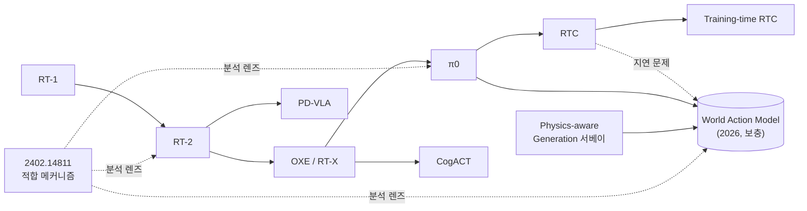
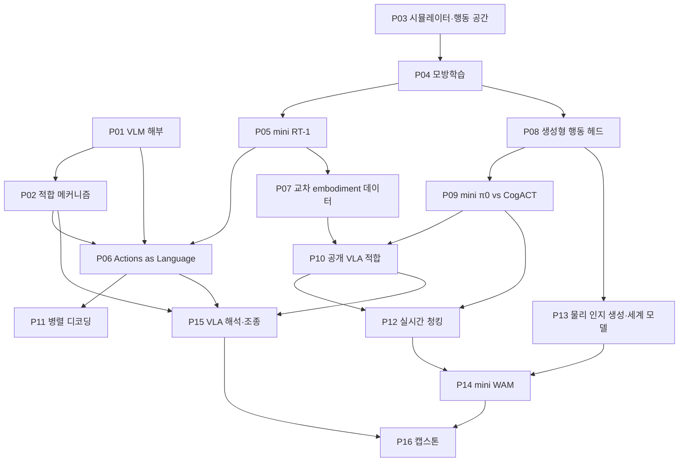

# Physical AI 학습 로드맵 (계획표)

> 작성 2026-09-27 · 대상: Transformer LLM·생성모델 이론/실무 경험이 있고 멀티모달 경험은 없는 20년차 SW 엔지니어
> 기준 자료: [`docs/papers/`](docs/papers/) 10편 · 로컬 머신: Apple M3 Pro / 18GB unified memory (NVIDIA GPU 없음)

## 0. 이 문서 사용법

| 절 | 내용 |
|---|---|
| §1 | Physical AI 연구 지형 (2026-09 기준) — 주어진 논문을 읽기 위한 좌표계 |
| §2 | 주어진 논문 10편의 위치와 의미, 읽기 순서 |
| §3 | LLM 지식 → Physical AI 대응표 |
| §4 | 지식 학습 모듈 (이론 커리큘럼 K1–K11) |
| §5 | 학습·실습 원칙 |
| §6 | 전체 일정표와 마일스톤 |
| §7 | 프로젝트 카드 (목표 / 실행 / 산출물 / 완료 기준) |
| §8 | 보충 읽기 목록 |
| §9 | 실습 환경·인프라 |
| §10 | 진행 현황 |

- 각 프로젝트는 저장소 루트의 `NN-slug/` 디렉토리에 위치한다. 프로젝트를 **시작할 때** §7의 카드를 그 디렉토리의 `README.md`로 옮기고, 이후 그 README를 결과 보고서로 키운다. 이 문서에는 상태(§10)만 갱신한다.
- 일정은 **주 10시간** 기준이다. 주 20시간이면 대략 절반으로 줄어든다.
- 각 카드의 "최소 범위"만 해도 해당 논문의 핵심은 체험할 수 있게 설계했다. "확장"은 시간이 남을 때 한다.

---

## 1. Physical AI 연구 지형 (2026-09 기준)

### 1.1 정의 — "로봇 제어"가 아니라 "물리 세계를 다루는 파운데이션 모델 스택"

Physical AI는 물리 세계를 **이해·추론**하고, 행동의 결과를 **예측**하고, 그 안에서 **행동**하는 AI다. 로봇 팔은 여러 embodiment 중 하나일 뿐이고, 휴머노이드·자율주행차·스마트 공간이 모두 같은 스택을 공유한다.


### 1.2 연구 축

| 축 | 핵심 질문 | 2025–26 대표 연구 | 주어진 논문 |
|---|---|---|---|
| **A. 행동 생성 (VLA)** | 사전학습 VLM을 어떻게 행동 모델로 바꾸나 | π0.5(2025.04), π\*0.6/RECAP(2025.11), **π0.7**(2026.04: 5B, 멀티스케일 메모리, 품질·속도 메타데이터와 서브골 이미지로 조건화하는 "steerable" 모델), Gemini Robotics 2(2026: ER 2 계획기 + 전신 VLA + 온디바이스 VLA 3단 구성), GR00T N1.7, SmolVLA | RT-1, RT-2, OXE, CogACT, π0 |
| **B. 세계 모델** | 행동하면 세계가 어떻게 바뀌나 | Genie 3(2025.08, Waymo World Model의 기반), V-JEPA 2(2025.06, 잠재 공간 예측·계획), **Cosmos 3**(2026.05 공개: 언어·이미지·비디오·오디오·행동을 하나의 Mixture-of-Transformers로, Super 64B·Nano 16B·Edge 4B), 평가 사다리 *plausible → controllable → actionable*(2609.16697) | Physics-aware Generation 서베이 |
| **C. World Action Model (WAM)** | 비디오 생성 백본으로 "상상하며" 행동할 수 있나 | **DreamZero**(2026.02: Wan2.1 14B 비디오 확산 모델로 비디오·행동을 함께 디노이징, GR00T N2의 기반. RoboArena Elo 1750 vs π0.5 1622, 대신 청크당 0.6–0.8초), Cosmos Policy(2026.01: 행동을 잠재 프레임으로 주입), UVA, LingBot-VA, Fast-WAM / 하이브리드: π0.7(세계 모델이 만든 서브골 이미지를 조건으로) | π0(MoT 설계), RTC(느린 모델의 실시간 문제), 서베이 |
| **D. 체화 추론** | 물리 상식·공간 추론·작업 계획 | Gemini Robotics-ER 1.6 / ER 2(2026.07), Cosmos-Reason1/2, PhysBrain 1.5(2026.09: 언어·공간 좌표·궤적·미래 영상을 한 자기회귀 백본의 토큰으로), Alpamayo 1.5(2026.03, 자율주행용 10B 추론 VLA, RL 후학습) | RT-2(CoT), CogACT(인지-행동 분리) |
| **E. 데이터·스케일링** | 무엇을 얼마나 모아야 하나 | OXE → DROID → AgiBot World, GEN-1(2026.04: 실세계 50만 시간), Xiaomi-Robotics-1(10만 시간), GR00T N1.7(1k→20k 시간 스케일링), EgoScale(인간 1인칭 20,854시간, log-linear 스케일링), HumanScale(인간 비디오가 로봇 데이터보다 나은 사전학습일 수 있음) | RT-1(다양성 > 양), OXE |
| **F. 적합·후학습** | 사전 지식을 잃지 않고 물리 과제에 맞추기 | co-training, Knowledge Insulation(2025.05), VLM2VLA(ICLR'26, 행동을 자연어로 표현해 LoRA만으로 적합), VLM4VLA(ICLR'26: VLM의 범용 능력은 VLA 성능의 약한 예측자, 병목은 비전), RL 후학습(SimpleVLA-RL, RLinf-VLA, RECAP, 세계 모델 안에서의 RL) | RT-2, π0, **2402.14811**, Training-time RTC |
| **G. 해석가능성·조종** | 적합된 모델 안에서 무슨 일이 일어나고, 어떻게 제어하나 | VLA steering(2509.00328: FFN 활성에서 속도·방향 의미 방향을 찾아 π0/OpenVLA 행동 조종), 6개 VLA 기계적 분석(2603.19233: 비전 경로가 지배, 언어는 과제에 따라 무시되기도, VLM·행동전문가 경로는 분리된 부분공간), VLA SAE(2603.19183), 층 중복(2606.20246: 층 절반 제거 가능), WAM steering + LQR(2607.14943) | **2402.14811** |
| **H. 실시간 실행·배포** | 수백 ms 지연 속에서 매끄럽게 행동하기 | RTC(NeurIPS'25), Training-time RTC(2025.12), VLASH(2025.12), FASTER(2026.03), FutureRTC(2026.07), 층 압축, 온디바이스 VLA | PD-VLA, RTC, Training-time RTC |
| **I. 시뮬레이션·평가** | 정책·세계 모델을 믿을 만하게 재는 법 | Newton 1.0(2026.03: Warp 기반, MuJoCo Warp 솔버 포함), Isaac Lab, 3DGS real-to-sim 평가(PolaRiS, real2sim-eval), 신경 시뮬레이터 평가(RoboWorld), LIBERO(포화) · SIMPLER · RoboCasa365 · MolmoSpaces · RoboArena(실세계 쌍대 비교 Elo) | CogACT(SIMPLER), RTC(Kinetix) |
| **J. 안전·거버넌스** | 실시간·물리적 위험을 어떻게 다루나 | Physical AI Governance(2607.22877), Embodied AI 안전 서베이, ASIMOV | (간접) |

### 1.3 2026년의 큰 흐름 다섯 가지

1. **VLA → WAM / 하이브리드.** 백본의 무게중심이 VLM(언어·의미)에서 비디오·세계 모델(동역학)로 확장되고 있다. 얻는 것은 grounding과 일반화, 치르는 것은 연산량과 지연이다. GR00T N2(DreamZero 기반), Cosmos Policy, π0.7(서브골 생성)이 모두 이 축 위에 있고, 오픈소스 도구에도 이미 들어왔다(LeRobot 0.6이 LingBot-VA·Fast-WAM·VLA-JEPA 같은 WAM 계열 정책을 지원).
2. **옴니모달 통합 백본.** 이해·생성·행동을 한 모델에서 다룬다(Cosmos 3, PhysBrain 1.5). π0에서 시작된 "토큰 종류별로 가중치를 나누고 attention은 공유하는" Mixture-of-Transformers 설계가 사실상 표준이 됐다.
3. **후학습의 LLM화.** SFT 이후 RL(RECAP, GRPO 계열), 품질·속도 메타데이터 조건화, 정책이 스스로 만든 롤아웃 재활용 — LLM post-training에서 익숙한 도구들이 그대로 들어오고 있다.
4. **스케일링 법칙의 등장.** 실세계 수십만 시간(GEN-1), 인간 1인칭 비디오의 log-linear 스케일링(EgoScale) — "데이터를 어떻게 행동 감독 신호로 바꾸나"가 병목이라는 주장도 나온다(2606.06556).
5. **적합의 과학.** 망각 방지(Knowledge Insulation, VLM2VLA), 무엇이 전이되는가(VLM4VLA), 내부 해석과 조종(VLA/WAM mechanistic interpretability). 2402.14811이 던진 "적합은 기존 메커니즘을 바꾸는가, 강화하는가"가 physical AI의 중심 질문 중 하나가 됐다.

그리고 이 모든 흐름을 가로지르는 제약이 **실시간성**이다. 모델이 커질수록(특히 WAM) RTC 계열 기법의 중요성이 커진다.

---

## 2. 주어진 논문의 위치와 의미

| # | 논문 | 축 | 한 줄 요지 | 2026년 관점의 의미 | 실습 |
|---|---|---|---|---|---|
| 1 | [RT-1](docs/papers/2212.06817v2.pdf) (2022) | A, E | 대규모 실세계 데이터 + Transformer 정책, 행동을 차원별 256-bin 토큰으로 | 이산 행동 토큰화와 "데이터 다양성 > 양"의 출발점. 이산 토큰은 FAST와 Knowledge Insulation의 이산 손실로 계승됨 | P05 |
| 2 | [RT-2](docs/papers/2307.15818v1.pdf) (2023) | A, F, D | VLM을 웹 데이터와 co-fine-tuning해 행동을 텍스트 토큰으로 출력 — **VLA의 탄생** | "웹 지식을 잃지 않고 적합하기" 문제의 출발점. 2026년 VLM2VLA·KI가 같은 질문을 재방문 | P06 |
| 3 | [Open X-Embodiment](docs/papers/2310.08864v9.pdf) (2023) | E | 22개 embodiment 데이터 표준화, 교차 embodiment 양의 전이 | 데이터 표준(RLDS)과 스케일링 사고의 출발점 → DROID, GEN-1, EgoScale | P07 |
| 4 | [π0](docs/papers/2410.24164v4.pdf) (2024) | A, C | PaliGemma + flow matching action expert(MoT), 고주파 행동 청크 | 2025–26 VLA의 표준 설계(π0.5→π0.7, SmolVLA, GR00T). MoT 구조는 WAM·Cosmos 3에도 이어짐 | P08–P10 |
| 5 | [CogACT](docs/papers/2411.19650v1.pdf) (2024) | A, D | VLM의 인지 특징 → DiT 행동 모듈, 적응형 행동 앙상블 | 인지-행동 분리(dual-system)의 전형, 행동 모듈 스케일링 | P08, P09 |
| 6 | [PD-VLA](docs/papers/2503.02310v2.pdf) (2025) | H | 자기회귀 행동 토큰을 Jacobi 고정점 반복으로 병렬 디코딩 | LLM 디코딩 가속 기법을 VLA로. 행동을 토큰으로 내는 통합 모델에 여전히 유효 | P11 |
| 7 | [RTC](docs/papers/2506.07339v2.pdf) (2025) | H | 추론 중 inpainting으로 청크를 비동기 실행 | 느린 대형 모델(특히 WAM)을 실시간으로 돌리는 표준 기법 | P12 |
| 8 | [Training-time RTC](docs/papers/2512.05964v2.pdf) (2025) | H, F | 학습 때 지연을 시뮬레이션해 행동 prefix로 조건화 | "추론 기법을 학습으로 옮긴다"는 패턴. per-token timestep(diffusion forcing 계열)과 연결 | P12 |
| 9 | [Generative Physical AI in Vision](docs/papers/2501.10928v2.pdf) (2025) | B, C | 물리 인지 생성의 분류: 명시적 시뮬레이션 vs 암묵적 학습 | 세계 모델·WAM의 기초 어휘와 물리 타당성 평가 관점 | P13, P14 |
| 10 | [Fine-Tuning Enhances Existing Mechanisms](docs/papers/2402.14811v1.pdf) (2024) | F, G | 적합은 기존 회로를 대체하지 않고 강화한다 (entity tracking 사례) + 도구(path patching, DCM, CMAP) | VLM→VLA, 비디오 모델→WAM 적합에서 "무엇이 보존·강화되는가"를 재는 방법론. entity tracking 자체가 다중 물체 상태 추적(물체 영속성) 능력과 같은 구조 | P02, P06, P15 |

> 참고: `CogACT ...-with-annotations.pdf`는 2411.19650v1과 같은 내용이다(하이퍼링크 주석만 있고 하이라이트·메모 없음).

**논문 계보와 이 로드맵의 읽기 순서**



읽기 순서(프로젝트 순서와 일치): **2402.14811**(P02, 분석 도구로 먼저) → RT-1(P05) → RT-2(P06) → OXE(P07) → CogACT·π0(P08–P10) → PD-VLA(P11) → RTC·Training-time RTC(P12) → 서베이(P13) → WAM 보충 논문(P14) → 2402.14811 재독(P15).

---

## 3. LLM 지식 → Physical AI 대응표

이미 아는 개념에 새 개념을 걸어두면 학습 속도가 가장 빠르다.

| LLM에서 익숙한 것 | Physical AI에서의 대응 | 등장 |
|---|---|---|
| 토크나이저, 어휘 | 행동 이산화: 차원별 256-bin(RT-1), 정수 토큰·저빈도 토큰 재할당(RT-2), DCT+BPE 압축(FAST) | RT-1, RT-2 / P05, P06 |
| Next-token prediction | 자기회귀 행동 디코딩. 청크 길이 H × 자유도 D만큼 토큰이 늘어 지연이 선형 증가 | RT-2, PD-VLA / P06, P11 |
| Prefix-LM, attention mask 설계 | PaliGemma의 prefix-LM, π0의 blockwise causal mask(관측·언어 / 고유수용 상태 / 노이즈 행동) | π0 / P01, P09 |
| MoE | π0 action expert: 토큰 종류별로 가중치를 나누고 self-attention은 공유(Mixture-of-Transformers). Cosmos 3·LingBot-VA도 같은 계열 | π0 / P09 |
| KV cache | 관측 prefix의 KV를 한 번 계산하고 flow 적분 10스텝 동안 재사용 | π0 / P09, P12 |
| Speculative / Jacobi decoding | PD-VLA의 병렬 고정점 디코딩. 이전 반복이 draft 역할을 하고, 먼저 고정되는 토큰 ≈ accepted token | PD-VLA / P11 |
| 이미지 diffusion / flow | "관측 조건부 행동 청크"를 생성 대상으로: DiT 행동 헤드, flow matching expert | CogACT, π0 / P08 |
| 스트리밍으로 이미 내보낸 토큰(취소 불가) | 추론하는 동안 실행이 확정된 d개 행동(frozen prefix) | RTC / P12 |
| Inpainting, guidance, CFG scale 상한 | RTC: 확정된 prefix와 겹침 구간을 guidance로 inpaint, 가중치는 β로 클리핑 | RTC / P12 |
| Fill-in-the-middle 학습, prompt loss masking | Training-time RTC: prefix를 teacher forcing, loss는 postfix만, 토큰별 노이즈 수준(diffusion forcing 계열) | Training-time RTC / P12 |
| 두 샘플을 평균내면 문장이 깨짐 | temporal ensembling: 서로 다른 모드의 두 청크를 평균 → 장애물에 부딪히는 무효 행동 | RTC / P04, P12 |
| Prefill이 지배하는 지연 | π0.5 추론 76ms 중 prefill 44ms. RTC의 추가 비용은 디노이즈(decode) 쪽에만 붙음 | RTC / P12 |
| Teacher forcing과 exposure bias | 공변량 이동과 compounding error. Training-time RTC는 추론 조건(지연)을 학습 때 재현 | P04, P12 |
| Pretrain → SFT → RLHF | 교차 embodiment 사전학습 → 고품질 과제 데이터 post-training → RL(RECAP, SimpleVLA-RL) | π0, OXE / P10 |
| Instruction 데이터 혼합비 | 웹 VQA + 로봇 궤적 co-fine-tuning 비율, OXE 데이터셋 혼합 가중치 | RT-2, OXE / P06, P07 |
| Catastrophic forgetting | VLM→VLA 적합 시 웹 지식 손실. co-training, Knowledge Insulation, LoRA(VLM2VLA) | RT-2 / P06, P15 |
| Scaling laws | 데이터 다양성 vs 양(RT-1), 교차 embodiment 전이(OXE), 실세계 수십만 시간·인간 비디오 스케일링 | RT-1, OXE / P05, P07 |
| Perplexity·벤치마크 | **오프라인 손실 ≠ 폐루프 성공률.** 시뮬 벤치(LIBERO, SIMPLER), 실세계 Elo(RoboArena) | 전 프로젝트 |
| 서빙 지연, 스트리밍 | 제어 주파수(3Hz~50Hz), 추론 지연 d, 비동기 실행 | RTC / P12 |
| Mechanistic interpretability | VLA 내부: 비전 경로 지배, 경로별 부분공간 분리, 의미 방향 steering | 2402.14811 / P02, P15 |
| (새로운 것) 멀티모달 입력 | 이미지 패치 토큰, SigLIP, projector. 카메라 수·해상도·히스토리 길이에 따라 토큰 수 폭증 | P01 |
| (새로운 것) 세계 모델 | "물리 세계의 언어 모델": 행동 조건부 다음 프레임/잠재 상태 예측 | 서베이 / P13, P14 |

---

## 4. 지식 학습 모듈 (이론 커리큘럼)

| 모듈 | 다룰 개념 | 주 자료 | 실습 |
|---|---|---|---|
| **K1. 멀티모달 기초** | ViT 패치 토큰화, CNN 특징과 FiLM 조건화, CLIP(softmax InfoNCE) vs SigLIP(sigmoid loss), DINOv2(자기지도 공간 특징), projector(선형/MLP), VLM 2단계 학습(정렬 → instruction), prefix-LM | 보충: ViT, CLIP, SigLIP, DINOv2, LLaVA, PaliGemma, Prismatic | P01 |
| **K2. 적합의 메커니즘과 해석** | activation patching, path patching, logit difference, 회로(circuit), attention head 역할, DCM, CMAP, linear probe, SAE, steering vector, CKA | **2402.14811**, 보충: IOI circuit, VLA 해석 논문들 | P02, P06, P15 |
| **K3. 물리 세계·embodiment 기초** | 좌표계와 SE(3), 회전 표현(오일러/쿼터니언/축각/6D), 정·역기구학, 자코비안, PD·임피던스 제어, 제어 주파수, 관절공간 vs 작업공간 행동, 절대 vs 델타 행동, 고유수용 상태, 카메라 모델, 접촉 시뮬레이션, sim-to-real 간극 | 보충: Modern Robotics(교재) 1–6장 발췌, MuJoCo 문서 | P03 |
| **K4. 모방학습** | 행동 복제(BC), 공변량 이동과 compounding error(DAgger), 다중모드 행동 분포, 이산화 vs 회귀 vs 생성 모델, action chunking, temporal ensembling, 관측·행동 정규화, **폐루프 평가 방법론**(성공률 신뢰구간) | 보충: ACT, Diffusion Policy | P04 |
| **K5. 이산 토큰 VLA 계보** | RT-1 구조(FiLM-EfficientNet, TokenLearner, 히스토리), 행동 토큰화, co-fine-tuning, 출력 제약 디코딩, 창발 능력 평가, 교차 embodiment 데이터 표준(RLDS), 행동 공간 정렬, 모델 용량과 전이 | **RT-1, RT-2, OXE**, 보충: OpenVLA | P05–P07 |
| **K6. 생성형 행동 헤드** | DDPM/DDIM, flow matching·rectified flow, 조건부 생성, 노이즈·timestep 샘플링, DiT, action expert(MoT), blockwise mask, 행동 앙상블(ACT TE, CogACT AAE) | **π0, CogACT**, 보충: Flow Matching, Diffusion Policy | P08, P09 |
| **K7. 적응·후학습** | 사전학습 vs post-training, LoRA vs full FT, 정규화 통계, Knowledge Insulation, RL 후학습(advantage 조건화, GRPO 계열), 메타데이터 조건화 | **π0**, 보충: π0.5, KI, SmolVLA, π\*0.6, π0.7, SimpleVLA-RL | P10 |
| **K8. 실시간 실행** | 추론 지연 d·실행 horizon s·예측 horizon H, 동기 vs 비동기 실행, 청크 경계 불연속, Jacobi decoding, inpainting guidance(ΠGDM), soft mask, 학습시간 지연 시뮬레이션 | **PD-VLA, RTC, Training-time RTC**, 보충: BID, diffusion forcing, VLASH | P11, P12 |
| **K9. 세계 모델과 물리 인지 생성** | 명시적 시뮬레이션(MPM, 강체, 3DGS와 결합) vs 암묵적 학습(비디오 확산), 잠재 세계 모델(JEPA), 행동 조건부 예측, 평가 사다리(plausible/controllable/actionable), 물리 타당성 벤치마크 | **서베이 2501.10928**, 보충: 2609.16697, V-JEPA 2 | P13 |
| **K10. World Action Model** | 비디오·행동 공동 생성, 역동역학(IDM) 방식, representation-only, action-as-latent-frame, latent action, VLA 대비 장단점, 하이브리드 | 보충: DreamZero, Cosmos Policy, UVA, WAM 서베이 2609.16074 | P14 |
| **K11. 평가·데이터 생태계** | 벤치마크의 포화와 한계(LIBERO → LIBERO-Plus/PRO), SIMPLER의 real-to-sim 상관, 쌍대 비교 평가(RoboArena), 신경 시뮬레이터 평가, 데이터 스케일링 | OXE, CogACT(SIMPLER), 보충: RoboArena | 전 프로젝트에 분산 |

---

## 5. 학습·실습 원칙

1. **폐루프 평가가 진실이다.** 오프라인 validation loss는 정책의 실제 성공률과 약하게만 상관한다. 행동을 내는 모든 프로젝트는 시뮬레이터 롤아웃 성공률을 **신뢰구간과 함께** 보고한다(에피소드 수 명시).
2. **논문의 그림·표 하나를 축소 재현한다.** 각 카드에 재현 대상을 명시했다. 절대 수치보다 **추세와 결론의 재현**이 목표다.
3. **Mac에서 작게 끝까지, 스윕은 클라우드로.** 로컬에서 작은 설정으로 파이프라인 전체를 돌려 버그를 잡은 뒤, 반복 실험·스윕은 RTX 4090급 클라우드(시간당 $0.3–0.7)로 보낸다. M3 Pro에서 몇 시간씩 걸리는 학습을 붙잡고 있는 것보다 싸고 빠르다. 클라우드 작업은 스크립트로만 돌리고 프로젝트마다 비용 상한을 적어 둔다.
4. **같은 벤치마크를 재사용한다.** PushT(2D, 빠름), LIBERO 한 스위트(언어 조건 다중 과제), ALOHA-sim(고주파 양팔)을 공통 시험대로 써서 방법 간 비교가 누적되게 한다.
5. **적합할 때마다 "무엇이 바뀌었나"를 본다.** P02에서 만든 해석 도구를 P06(VLM→VLA), P10(공개 VLA), P15(종합)에서 반복 적용한다. 이것이 2402.14811을 커리큘럼의 관통선으로 쓰는 방식이다.
6. **산출물 형식을 통일한다.** 코드 + `README.md`(가설 → 실험 → 결과 → 해석 → 다음 질문) + 해당 논문 노트(`docs/notes/`).
7. **공통 코드는 두 번째 사용 때 추출한다.** 평가 하네스·해석 도구 같은 것은 두 번째 프로젝트에서 필요해질 때 `common/`으로 옮긴다.
8. **한 주의 리듬.** 논문·이론 약 3시간 → 구현·실험 5–6시간 → 결과 정리 1–2시간. 논문은 프로젝트 시작 직전에 읽고, 프로젝트가 끝나면 노트를 한 번 더 고친다(실험 후에 논문이 다르게 읽힌다).

---

## 6. 전체 일정표

주 10시간 기준 핵심 경로 약 30주(7개월), 캡스톤 포함 약 34주. 주차가 겹치는 칸은 반 주 단위다.

| 주차 | Phase | 프로젝트 | 핵심 논문 | 모듈 | 환경 | 마일스톤 |
|---|---|---|---|---|---|---|
| 0 | 준비 | §9의 준비 체크리스트 | — | — | Mac | — |
| 1–2 | 1 기반 | [P01](#p01-01-vlm-from-llm--llm-엔지니어를-위한-vlm-해부) VLM 해부 | (보충) ViT·SigLIP·LLaVA·PaliGemma | K1 | Mac | |
| 3–4 | 1 기반 | [P02](#p02-02-finetuning-mechanisms--적합은-무엇을-바꾸는가-해석-도구-만들기) 적합 메커니즘 | **2402.14811** | K2 | Mac | **M1** 비전 토큰이 LM에 들어가는 구조 + 적합 분석 도구 |
| 5–6 | 2 물리 세계 | [P03](#p03-03-embodiment-sim--시뮬레이터-행동-공간-폐루프-평가-하네스) 시뮬레이터·행동 공간 | 전 논문의 행동 공간 절 | K3 | Mac | |
| 6–7 | 2 물리 세계 | [P04](#p04-04-imitation-learning--모방학습의-근본-문제) 모방학습 | (보충) ACT·Diffusion Policy | K4 | Mac | **M2** 폐루프 평가 하네스 + BC 베이스라인 |
| 8–9 | 3 적합 I | [P05](#p05-05-mini-rt1--rt-1-축소-재현) mini RT-1 | **RT-1** | K5 | Mac / Linux | |
| 10–12 | 3 적합 I | [P06](#p06-06-actions-as-language--rt-2-vlm을-vla로-적합하기) Actions as Language | **RT-2** (+2402.14811) | K5, K2 | Mac (+클라우드) | |
| 12–14 | 3 적합 I | [P07](#p07-07-cross-embodiment-data--open-x-embodiment-데이터가-곧-모델) 교차 embodiment 데이터 | **OXE** | K5, K11 | Mac | **M3** 이산 토큰 VLA 계보 재현 + 첫 "적합의 과학" 표 |
| 14–16 | 4 적합 II | [P08](#p08-08-generative-action-heads--행동-청크를-생성-모델로-diffusion-vs-flow) 생성형 행동 헤드 | **π0, CogACT** | K6 | Mac | |
| 16–18 | 4 적합 II | [P09](#p09-09-mini-vla-architectures--π0-vs-cogact-vlm에-행동-생성기를-붙이는-두-방법) mini π0 vs CogACT | **π0, CogACT** | K6 | Mac (+클라우드) | |
| 19–20 | 4 적합 II | [P10](#p10-10-adapting-open-vlas--공개-파운데이션-vla-적합하기) 공개 VLA 적합 | **π0** (+π0.5·KI·SmolVLA) | K7 | 클라우드 | **M4** 연속 생성형 VLA 직접 구현 + 공개 VLA 적합 |
| 21 | 5 실시간 | [P11](#p11-11-parallel-decoding--pd-vla-자기회귀-vla-가속) 병렬 디코딩 | **PD-VLA** | K8 | Mac | |
| 22–24 | 5 실시간 | [P12](#p12-12-real-time-chunking--실시간-실행-rtc와-training-time-rtc) 실시간 청킹 | **RTC, Training-time RTC** | K8 | Mac (+클라우드) | **M5** 지연-성공률 곡선 재현 + 비동기 런타임 |
| 24–26 | 6 세계 모델 | [P13](#p13-13-physics-aware-generation--물리를-아는-생성-명시적-시뮬레이션-vs-암묵적-학습) 물리 인지 생성 | **2501.10928** | K9 | Mac | |
| 26–28 | 6 세계 모델 | [P14](#p14-14-mini-world-action-model--world-action-model-결과를-상상하며-행동하기) mini WAM | (보충) UVA·Cosmos Policy·DreamZero | K10 | Mac + 클라우드 | **M6** 세계 모델 평가 사다리 + WAM vs VLA 비교 |
| 29–30 | 7 해석 | [P15](#p15-15-vla-interpretability--vla-내부-해석과-조종) VLA 해석·조종 | **2402.14811** (+VLA 해석 보충) | K2 | Mac (+클라우드) | **M7** VLA 해석 보고서 |
| 31–34 | 8 캡스톤 | [P16](#p16-16-capstone--셋-중-하나를-고른다) (선택) | 전체 | 전체 | 트랙별 | M8 |

**압축 경로 (약 18주)**: 모든 카드의 "최소 범위"만 수행하고 다음을 합친다 — P03+P04(2주), P05는 ablation 1개만(1주), P07은 스키마 비교·정규화까지(1주), P11은 P06의 확장 과제로 흡수, P13은 암묵적 세계 모델만 하고 곧바로 P14로 연결.

**프로젝트 간 산출물 흐름**



---

## 7. 프로젝트 카드

카드 형식: **기간 · 환경 · 지식 모듈 · 논문** → 왜 지금 → 이론 목표 → 실행(최소 범위) → 확장 → 산출물 → 완료 기준 → 다음 프로젝트로 넘기는 것.
공통 시험대: **PushT**(2D 밀기, 다중모드 행동의 교과서적 예, 10Hz) · **LIBERO 한 스위트**(언어 조건 다중 과제, 10개 과제 × 50 데모) · **ALOHA-sim**(양팔 14차원, 50Hz — 고주파 청킹이 의미를 갖는 설정).
LIBERO는 macOS를 공식 지원하지 않으므로 학습·데이터 처리는 Mac에서, 폐루프 평가는 Linux 인스턴스에서 하는 것을 기본으로 한다(Mac 수동 설치 성공 사례는 있음, §9.2). Mac만 쓰고 싶다면 Meta-World로 대체할 수 있다.

### Phase 1 — 기반: 멀티모달과 적합 분석 도구

#### P01 `01-vlm-from-llm/` — LLM 엔지니어를 위한 VLM 해부
- **기간** 2주 · **환경** Mac(MPS) · **모듈** K1 · **논문** 보충 ViT, CLIP, SigLIP, LLaVA, PaliGemma
- **왜 지금**: 2026년 physical AI의 모든 축(VLA, 체화 추론, WAM의 조건 입력, 옴니모달 백본)이 "비전 토큰을 언어 모델에 넣는" 구조 위에 서 있다. 멀티모달은 가장 큰 공백이므로 가장 먼저 메운다.
- **이론 목표**
  - 이미지가 토큰이 되는 과정: 패치화, 위치 임베딩, 해상도·패치 크기와 토큰 수의 관계(224px / 패치 14 → 256 토큰)
  - 대조학습: CLIP(softmax InfoNCE) vs SigLIP(sigmoid loss, 배치 크기 의존성 차이)
  - 의미 특징(SigLIP) vs 공간·기하 특징(DINOv2) — Prismatic/OpenVLA/CogACT가 둘을 합치는 이유
  - LLaVA식 projector와 2단계 학습, PaliGemma의 prefix-LM(이미지+프롬프트는 양방향, 출력은 causal)
- **실행 (최소 범위)**
  1. 패치화를 텐서 reshape로 직접 구현해 HF SigLIP의 patch embedding 출력과 일치 확인. 해상도 224/384/512에서 토큰 수·메모리·지연 측정
  2. SigLIP으로 zero-shot 분류와 이미지-텍스트 검색(recall@k). 인코더를 고정하고 작은 projection head를 softmax loss와 sigmoid loss로 각각 학습해 비교
  3. DINOv2와 SigLIP의 패치 특징을 PCA로 색칠해 비교(물체 경계·배치가 어디에 더 잘 보이는가)
  4. **tiny VLM**: 고정 SigLIP + 2층 MLP projector + 고정 SmolLM2-360M. Flickr8k 또는 COCO 캡션 일부로 projector만 학습(LLaVA stage 1)
  5. 같은 tiny VLM을 causal mask와 prefix-LM mask로 각각 학습해 비교하고, mask 행렬을 시각화
- **확장**: LM에 LoRA 추가 학습(stage 2) · SmolVLM2 코드 읽기(이미지 토큰 삽입 위치, pixel shuffle로 토큰 압축) · ResNet에 FiLM 층을 넣어 텍스트 조건부 특징 만들기(P05 예습)
- **산출물**: `tiny_vlm/` 코드, 해상도별 토큰 수·지연 표, 특징 PCA 그림, mask 비교표, `docs/notes/vlm-basics.md`
- **완료 기준**: ① 토큰 수를 손으로 계산해 실측과 일치 ② tiny VLM이 처음 보는 이미지에서 물체·색 수준의 캡션을 생성하고, projector 학습 전후 캡션 loss 감소를 수치로 제시 ③ prefix-LM과 causal의 차이를 자기 코드로 설명
- **넘기는 것**: tiny VLM(P02 이미지 과제, P06 백본 후보), mask 코드(P09 blockwise mask)

#### P02 `02-finetuning-mechanisms/` — 적합은 무엇을 바꾸는가: 해석 도구 만들기
- **기간** 2주 · **환경** Mac · **모듈** K2 · **논문** **2402.14811**, 보충 IOI circuit
- **왜 지금**: physical AI의 핵심 연산은 "사전학습 모델을 물리 과제에 적합"하는 것이다(VLM→VLA, 비디오 모델→WAM, VLM→체화 추론기). 적합이 기존 메커니즘을 강화하는지·대체하는지·파괴하는지를 재는 도구를 먼저 만들어 두면 P06(VLM→VLA), P10(공개 VLA), P15(종합)에서 같은 렌즈로 반복 관찰할 수 있다. 가장 익숙한 LLM 영역에서 출발하므로 진입 비용도 낮다.
- **이론 목표**
  - **과제**: 상자 7개와 단일 토큰 물체. 형식 `The {o1} is in Box {L1}, …, the {o7} is in Box {L7}. Box {Lq} contains the` → `{oq}` (우연 정확도 0.14). 물체를 라벨보다 먼저 써서 반복 구간 복사로 풀 수 없게 만든 설계
  - **모델**: LLaMA-7B(0.66) / Vicuna-7B(대화 적합, 0.67) / Goat-7B(산술 데이터 LoRA, 0.82) / FLoat-7B(같은 데이터 full FT, 0.82)
  - **방법**: path patching(송신→수신 edge 단위로 noise 입력의 기여를 이식, 정답 확률의 상대 변화로 점수화), 회로 = {(head, 토큰 위치)}, minimality·faithfulness·incompleteness(평균 ablation 기준), **DCM**(object·label·position 세 desideratum별로 희소 head 마스크를 학습, L = −logit_target + λΣ(1−W)), **CMAP**(같은 입력을 두 모델에 넣고 적합 모델의 head 출력을 base 모델의 같은 head에 이식)
  - **발견**: 72-head 회로가 D Structure Reader(5) → C Position Detector(20) → B Position Transmitter(7) → A Value Fetcher(40) 순으로 흐른다. 메커니즘은 **위치 포인터** — 물체 값을 옮기지 않고, 질의된 구절의 "위치"를 찾아 역참조한다. base 회로를 적합 모델 안에서 돌려도 faithfulness 0.88–0.97(무작위 회로 ≈ 0), 적합 모델의 회로는 base 회로의 상위 집합(175 head)이고 그룹별 역할도 같다. CMAP으로 적합 모델의 Value Fetcher 출력을 LLaMA에 이식하면 적합 모델 정확도까지 오른다. LoRA와 full FT의 양상이 같다
  - **physical AI 대응**: 물체–용기 바인딩은 "사과를 C 상자에" 같은 지시 grounding 그 자체이고, 조작 중 다중 물체 상태 추적(가려짐 포함)과 세계 모델의 물체 영속성으로 이어진다. 위치 포인터는 앞쪽에 구절이 끼어들면 깨진다 — VLM에서 "위치"가 순서 인덱스인지, 이미지 패치 인덱스인지, 2D 좌표인지가 혼잡한 장면·카메라 이동에 대한 강건성을 좌우한다
- **실행 (최소 범위)**
  1. 논문 형식 데이터 생성기와 counterfactual 쌍(object / label / position) 생성
  2. 로컬 모델 쌍: Qwen2.5-1.5B → Qwen2.5-Math-1.5B(LLaMA→Goat 대응), Llama-3.2-1B → Llama-3.2-1B-Instruct(LLaMA→Vicuna 대응). 정확도와 logit difference 측정 (7B 원 논문 재현은 클라우드 선택)
  3. activation patching으로 후보를 거르고 path patching으로 회로 확정, minimality·faithfulness 계산
  4. 적합 모델에서 회로를 다시 찾아 overlap 측정(상위 집합인가?), base 회로를 적합 모델 안에서 돌린 faithfulness 측정(Table 1 축소판)
  5. CMAP: 적합 모델의 그룹별 head 출력을 base에 이식 — 어느 그룹이 성능 차이를 설명하나. 메모리는 한 모델의 활성을 디스크에 캐시한 뒤 다른 모델을 로드하는 방식으로 해결
  6. **이미지 버전**: 글자 라벨 상자 3–7개와 물체 그림을 렌더링한 "visual boxes" + `Box F contains the` 질의로 SmolVLM2에서 같은 분석(nnsight 사용 — P15에서 SmolVLA 백본과 비교할 원 VLM이다). 2D 위치는 두고 읽기 순서만 바꾸는 쌍(또는 그 반대)으로 "위치"의 정체를 확인
- **도구**: TransformerLens 4.0(LM 쪽에 가장 깔끔. VLM은 SmolVLM-Instruct·Qwen2.5-VL-3B까지 검증됐고 SmolVLM2·PaliGemma는 미지원), nnsight(임의 PyTorch 모듈을 감쌀 수 있어 SmolVLM2와 LeRobot 정책까지 적용 가능), pyvene(DCM류 학습형 개입). 원 논문 코드·데이터: finetuning.baulab.info
- **확장**: DCM 구현 · EAP-IG 같은 gradient 기반 근사로 탐색 가속 · 상자 내용이 바뀌는(move/remove) 동적 버전 — 조작 중 상태 추적에 더 가까움
- **산출물**: `common/interp/`(hook·patching 유틸, 이후 재사용), 회로 다이어그램, patching 히트맵, CMAP 결과표, `docs/notes/2402.14811.md`
- **완료 기준**: ① 소형 모델에서 entity tracking 회로를 찾고 faithfulness 수치 제시 ② base와 적합 모델의 회로 overlap과 CMAP 결과로 "강화 vs 대체"를 자기 판정 ③ 이미지 버전 과제에서 인과적으로 중요한 구성요소 1개 이상 식별
- **넘기는 것**: 해석 도구(P06, P10, P15), 이미지 버전 entity tracking 과제(P06·P15의 "보존 측정 과제")

### Phase 2 — 물리 세계와 행동

#### P03 `03-embodiment-sim/` — 시뮬레이터, 행동 공간, 폐루프 평가 하네스
- **기간** 1.5주 · **환경** Mac · **모듈** K3, K11 · **논문** 주어진 논문 전체의 "행동 공간" 절(비교용)
- **왜 지금**: 정책이든 세계 모델이든 모든 physical AI 모델은 "상태"와 "행동"의 정의에서 출발한다. 논문마다 행동 공간이 다르고(엔드이펙터 델타 vs 관절 목표, 수 Hz vs 수십 Hz), 이 차이가 토큰화·청크 길이·교차 embodiment 정렬의 난이도를 결정한다.
- **이론 목표**: 좌표계와 SE(3), 회전 표현 4종과 각각의 함정(짐벌락, 이중 덮개, 연속성), 정·역기구학과 자코비안, PD·작업공간 제어, 제어 주파수, 절대 vs 델타 행동, 고유수용 상태, 카메라 내·외부 파라미터, 시뮬레이터 스텝과 접촉, sim-to-real 간극
- **실행 (최소 범위)**
  1. MuJoCo + [mujoco_menagerie](https://github.com/google-deepmind/mujoco_menagerie)의 Franka Panda로 테이블 장면 구성, 카메라 2대(정면·손목) 렌더
  2. 자코비안 기반 IK / 작업공간 컨트롤러로 엔드이펙터를 목표 포즈로 이동. 같은 궤적을 "관절 목표(고주파)"와 "엔드이펙터 델타(저주파)" 행동으로 각각 표현해 비교
  3. 색이 다른 물체 2–3개로 언어 조건 pick-and-place 스크립트 전문가 작성 → 데모 수집 후 LeRobotDataset 형식으로 저장(관측: 이미지 2장 + 상태, 행동: 7차원 델타)
  4. **폐루프 평가 하네스**: N 에피소드 실행, 성공 판정, 성공률 + Wilson 신뢰구간, 롤아웃 영상 저장
  5. 주어진 논문들의 행동 공간 비교표 작성(차원, 좌표계, 주파수, 표현)
- **확장**: 도메인 랜덤화(조명·색·카메라 위치) 옵션 · SO-ARM 모델로 같은 과제 구성(P16 실물 트랙 대비)
- **산출물**: 환경 코드, 데모 데이터셋, 평가 하네스, `docs/notes/action-spaces.md`
- **완료 기준**: ① 스크립트 전문가 성공률 ≥ 95% (50회) ② 저장한 데이터셋을 재생하면 동일 궤적 재현 ③ 평가 하네스를 다른 프로젝트에서 import해서 쓸 수 있음
- **넘기는 것**: 평가 하네스(이후 모든 정책 프로젝트, 두 번째 사용 시 `common/`으로 추출), 스크립트 전문가(P04 DAgger), 데이터 파이프라인

#### P04 `04-imitation-learning/` — 모방학습의 근본 문제
- **기간** 1.5주 · **환경** Mac · **모듈** K4 · **논문** 보충 ACT, Diffusion Policy (RT-1의 이산화 동기 예습)
- **왜 지금**: VLA든 WAM이든 대부분 행동 복제(BC)로 학습한다. "다중모드 행동 분포", "compounding error", "청킹"은 이후 모든 설계 선택(이산 토큰, 생성형 헤드, RTC)의 이유다. LLM에서의 exposure bias와 닮았지만 물리 세계에서는 오류가 상태를 바꿔 누적된다는 점이 다르다.
- **이론 목표**: BC와 공변량 이동, DAgger, 평균 회귀(MSE)가 다중모드 분포에서 실패하는 이유, 이산화(분류)·혼합 모델·생성 모델의 비교, action chunking과 temporal ensembling, 관측·행동 정규화, 성공률 신뢰구간과 필요한 에피소드 수
- **실행 (최소 범위)** — PushT(`gym-pusht`, LeRobot 데이터셋 `lerobot/pusht`)
  1. 같은 인코더 위에 네 가지 헤드: MSE 회귀, 차원별 256-bin 병렬 분류(RT-1 방식), 256-bin 자기회귀 분류(RT-2 방식), (선택) 가우시안 혼합
  2. T 블록을 왼쪽·오른쪽으로 돌아가는 다중모드 상황에서 각 헤드의 행동 분포를 시각화. 덧붙여 합성 2D "갈림길"(모드가 (−1,+1)과 (+1,−1)) 데이터로 확인: 차원별 독립 bin은 섞인 행동 (−1,−1)을 낼 수 있고 자기회귀 bin은 못 낸다 — RT-1이 속도를 위해 받아들인 trade-off
  3. 청크 길이 H ∈ {1, 4, 8, 16} × 실행 길이 비교, ACT식 temporal ensembling 적용
  4. 데모 수(25/50/100/전체)별 성공률 곡선. P03 환경에서 스크립트 전문가로 DAgger 2–3 라운드
  5. **오프라인 validation loss vs 폐루프 성공률 산점도** — 이 로드맵 전체의 핵심 교훈을 직접 확인
- **확장**: 이미지 기반 vs 상태(키포인트) 기반 비교 · 관측 히스토리 길이 효과
- **산출물**: 방법별 성공률 표(신뢰구간 포함), 행동 분포 그림, loss-성공률 산점도
- **완료 기준**: ① 이산/혼합 헤드가 MSE 헤드보다 유의하게 나은 성공률을 보이거나, 아니라면 원인 분석 ② 청킹 효과 곡선 ③ "validation loss로 체크포인트를 고르면 안 되는 이유"를 자기 데이터로 설명
- **넘기는 것**: BC 베이스라인(P05·P08의 비교 기준), 청킹·앙상블 코드(P08, P12)

### Phase 3 — 파운데이션 모델을 행동 모델로 적합 I: 이산 토큰 계보

#### P05 `05-mini-rt1/` — RT-1 축소 재현
- **기간** 2주 · **환경** Mac(학습) + Linux 인스턴스(LIBERO 평가, §9.2) · **모듈** K5 · **논문** **RT-1**
- **왜 지금**: VLA 이전에 "Transformer + 대규모 실세계 데이터 + 이산 행동 토큰"으로 일반화를 보인 첫 사례다. 이미지 토큰 압축, 언어 조건화, 히스토리, 행동 bin이라는 설계 선택이 이후 모든 VLA의 출발점이다.
- **이론 목표**
  - **구조(총 35M)**: 6프레임 300×300 → ImageNet EfficientNet-B3 + FiLM 26층(USE 512차원 문장 임베딩으로 조건화. γ·β를 0으로 초기화해 처음엔 항등 → 사전학습 특징 보존) → 프레임당 9×9 = 81 토큰 → TokenLearner로 8 토큰 → 48 토큰을 decoder-only Transformer(8층, 19M) → 11차원 × 256-bin을 **한 번의 forward로 병렬 출력**(자기회귀 아님)
  - **행동**: 팔 7(x, y, z, roll, pitch, yaw, 그리퍼) + 이동 베이스 3 + 모드 1(팔 / 베이스 / 종료), 3Hz 폐루프
  - **지연 설계**: 100ms 미만 예산 — TokenLearner로 2.4×, 프레임 토큰 재사용으로 1.7× 가속, 추론 15ms. 상태 캡처와 행동 적용 사이에 고정 280ms 대기를 둬 지터 제거
  - **데이터·결과**: 13대 로봇·17개월·약 13만 데모·744개 지시. seen 97 / unseen 76 / 방해물 83 / 배경 59 (Gato 65/52/43/35, BC-Z 72/19/47/41)
  - **아키텍처 ablation**(Table 13): Gaussian 헤드 68/43/37/35(다중모드 평균), ImageNet 초기화 없음 → unseen 43, 히스토리 없음 → 방해물 50(어려운 방해물 64→14), 자기회귀 행동 → 36ms로 느려지고 이득 없음
  - **데이터 ablation**(Table 7): 과제 25% 제거가 데이터 49% 제거와 비슷한 일반화 손실 → **다양성 > 양**
  - **이종 데이터 흡수**: 시뮬 데이터를 섞자 시뮬에만 있던 물체 성공률 23→87. Kuka 데이터를 2:1로 섞자(roll·pitch를 0으로 맞추는 거친 정렬) bin-picking 22→39
  - 모델 선택은 real-to-sim 평가(RetinaGAN) 순위로 — 평가 비용 문제의 초기 해법
- **실행 (최소 범위)**
  1. mini RT-1(≈15M): timm EfficientNet-B0 + 항등 초기화 FiLM(고정 MiniLM 문장 임베딩으로 USE 대체) + TokenLearner(→8) + 6프레임 히스토리 + 4층 Transformer, 7차원 델타 + 종료를 각 256-bin으로 병렬 출력
  2. LIBERO 한 스위트(권장 LIBERO-Object 또는 Spatial)에서 학습, 과제당 50회 폐루프 평가
  3. Ablation(Table 13 축소판): ImageNet 초기화 유무, FiLM vs 텍스트 후반 결합(late concat), 1 vs 6 프레임, TokenLearner 유무(지연 포함). 평가에 방해물 추가·테이블 텍스처 변경 조건을 넣는다
  4. 다양성 vs 양(Table 7 축소판): 같은 총 에피소드 수에서 "모든 과제 × 과제당 데모 상한" vs "과제 75% × 전체 데모" — 보지 못한 조합에 대한 일반화 측정
- **확장**: 행동 bin 수(64/256/1024)와 범위 클리핑의 영향 · 시각적으로 바꾼 두 번째 도메인(일부 물체는 거기에만 존재)을 섞어 RT-1 Table 4 축소판 · Language-Table 시뮬레이터로 같은 실험
- **산출물**: mini RT-1 코드, ablation 표, 다양성 vs 양 그래프, `docs/notes/rt1.md`
- **완료 기준**: ① 선택한 스위트에서 P04 BC 베이스라인 이상의 성공률(신뢰구간 포함) ② ablation의 방향성을 RT-1 결과와 비교해 설명 ③ 다양성 vs 양 실험의 결론
- **넘기는 것**: 행동 토크나이저(P06, P11), LIBERO 데이터 로더

#### P06 `06-actions-as-language/` — RT-2: VLM을 VLA로 적합하기
- **기간** 2.5주 · **환경** Mac + (선택) 클라우드 24–48GB GPU 수 시간 · **모듈** K5, K2 · **논문** **RT-2**, 2402.14811(분석 도구), 보충 OpenVLA, VLM2VLA
- **왜 지금**: VLA의 정의 그 자체다. 동시에 "웹 지식을 잃지 않고 적합하기"라는, 2026년의 Knowledge Insulation·VLM2VLA·VLM4VLA가 여전히 다루는 질문의 출발점이다.
- **이론 목표**
  - **백본**: PaLI-X 5B/55B(ViT-22B + UL2 인코더-디코더), PaLM-E 12B(decoder-only PaLM + ViT-4B). 입력은 이미지 1장 + `Q: what action should the robot take to [task]? A:` — 히스토리도 FiLM도 없다
  - **행동을 텍스트로**: 종료 + EE 델타 6 + 그리퍼 = 정수 8개를 공백으로 구분. PaLI-X는 0–999 정수가 이미 단일 토큰이라 그대로 쓰고, PaLM-E는 가장 드문 토큰 256개를 덮어쓴다. 새 파라미터 없음. RT-1과 달리 **자기회귀** 디코딩
  - **co-fine-tuning**: 로봇 데이터 비중 ≈50%(PaLI-X)·≈66%(PaLM-E). 로봇 프롬프트에서는 행동 토큰만 샘플링하도록 logit 마스크
  - **추론 인프라**: 클라우드 TPU, 55B는 1–3Hz, 5B는 ≈5Hz — 지연이 이후 PD-VLA·청킹·RTC의 동기
  - **결과**: seen 91–93(RT-1 92와 같음), unseen 평균 32 → 62, 창발 과제(기호·추론·인물 인식) 17 → 60 — **이득은 전부 일반화에서** 나온다
  - **Table 6**: 5B scratch 9 / 5B FT 42 / 5B co-FT 44 / 55B FT 52 / 55B co-FT 63 → 웹 사전학습은 필수, co-FT가 FT보다 낫고(망각 감소), 클수록 낫다. 단 5B에서 co-FT 이득은 2점뿐
  - **한계**: 의미는 웹에서 오지만 **동작은 로봇 데이터에서만** 온다 — 닦기·손잡이 잡기·접기 같은 새 동작은 여전히 불가. CoT("Plan:" 필드 적합)는 정성적 결과뿐
- **실행 (최소 범위)**
  1. SmolVLM2-256M/500M(또는 P01 tiny VLM)에 두 어휘 방식 구현: 정수 토큰 방식(0–255가 단일 토큰인지 먼저 확인) / 저빈도 토큰 256개 덮어쓰기. LIBERO 한 스위트 데모로 적합하고, logit 마스크 유무에 따른 무효 행동률 측정
  2. 적합 방식 비교(Table 6 축소판): (a) 무작위 초기화(scratch) (b) 로봇 데이터만 (c) co-fine-tuning(로봇 50% + VQAv2 일부와 시뮬레이터에서 자동 생성한 장면 질문, 예: "그릇은 무슨 색?") (d) LoRA만
  3. 각 모델에 대해 (i) 폐루프 성공률 (ii) 보지 못한 지시(동의어·속성·다른 언어) 성공률 (iii) VQA 정확도 유지율 (iv) **P02 도구로 visual boxes 회로 보존도(CMAP)** → 표 하나로 정리
  4. 제어 주파수 측정: 8토큰 순차 디코딩이 지연을 지배함을 확인(P11 예고)
- **확장**: 창발적 기호 grounding(Table 5 축소판) — 숫자·아이콘 목표가 있는 2D 밀기 환경을 만들어 색·위치 지시로만 학습하고 "3으로 밀어", "2+1로 밀어", 다른 언어 지시로 테스트, 같은 데이터의 mini RT-1과 비교 · "Plan:" CoT 타깃 추가 · 행동을 자연어 숫자열로 표현(VLM2VLA 방식) · 행동 표현을 FAST 토큰으로 교체
- **산출물**: 적합 방식 × (성공률, VQA 유지율, 회로 보존도) 표 — 이 로드맵의 첫 번째 "적합의 과학" 결과
- **완료 기준**: ① scratch 기준선 대비 세 적합 방식(로봇 데이터만 / co-fine-tuning / LoRA)의 trade-off를 수치로 제시 ② 최소 한 방식이 P05와 비교 가능한 성공률 ③ co-fine-tuning이 무엇을 지키는지에 대한 자기 결론을 RT-2의 주장과 대조
- **넘기는 것**: 토큰 VLA(P11 병렬 디코딩 대상), 적합 모델 쌍(P15)

#### P07 `07-cross-embodiment-data/` — Open X-Embodiment: 데이터가 곧 모델
- **기간** 2주 · **환경** Mac (데이터는 부분 다운로드·스트리밍) · **모듈** K5, K11 · **논문** **OXE**, 보충 DROID
- **왜 지금**: 2026년 경쟁의 핵심 축은 데이터다(실세계 수십만 시간, 인간 1인칭 비디오). OXE는 이질적인 embodiment 데이터를 하나로 모으는 문제 — 행동 공간·좌표계·주파수·카메라 불일치 — 를 처음 대규모로 다뤘다.
- **이론 목표**
  - **규모와 형식**: 60개 데이터셋, 100만+ 궤적, 22개 embodiment, 21개 기관(34개 연구실), 527개 스킬(160,266개 과제). RLDS(tfrecord) 에피소드 형식
  - **거친 정렬(coarse alignment)**: 데이터셋마다 대표 카메라 1대, 행동은 7차원 EE(+종료) = 8차원 × 256-bin, **데이터셋별 정규화** 후 bin, 추론 때 로봇별로 역정규화. 좌표계는 맞추지 않는다(같은 행동 벡터가 로봇마다 다른 움직임). 제어 주파수도 제각각(3–10Hz). 로봇 식별 입력이 없어 이미지가 유일한 단서
  - **결과**: 데이터가 적은 도메인에서 RT-1-X 평균 63 vs 원 방법 41 / 단일 RT-1 44. 데이터가 많은 도메인에서는 35M RT-1-X가 **underfit**(Google Robot 92→73), 55B RT-2-X는 유지(91) → **모델 용량이 전이를 제한**
  - **스킬 전이**: WidowX(Bridge) 데이터에만 있는 스킬을 Google Robot이 수행 — RT-2 27.3 → RT-2-X 75.8, Bridge를 빼면 42.8. 의미는 웹에서, 동작은 다른 로봇에서 온다
  - **ablation**: 히스토리 2프레임 44.4 vs 없음 14.5, scratch 0, co-FT ≈ FT — 로봇 데이터가 다양해지면 co-FT의 이점이 줄어든다(RT-2와 다른 결론)
  - **한계**: 센서·구동이 크게 다른 로봇 없음, 보지 못한 로봇 테스트 없음, 양의/음의 전이를 가르는 규칙 없음
  - **2026 연결**: DROID·AgiBot World → GEN-1(실세계 50만 시간), 인간 1인칭 비디오(EgoScale) — "무엇을 모으고 어떻게 정렬하나"가 여전히 핵심 질문
- **실행 (최소 범위)**
  1. **데이터 공학**: 일부러 이질적인 소규모 OXE 데이터셋 3–4개를 HF Hub의 LeRobot 형식(v3.0) 변환본으로 연다 — 예: `lerobot/utokyo_xarm_pick_and_place`(57MB, xArm, EE 자세+그리퍼), `lerobot/austin_buds_dataset`(91MB, Franka, EE 델타), `lerobot/tokyo_u_lsmo`(24MB, Cobotta, EE 속도 10Hz), `lerobot/ucsd_kitchen_dataset`(49MB, xArm, 2Hz). 원본 RLDS 형식도 가장 작은 `nyu_rot_dataset_converted_externally_to_rlds`(0.01GB)를 TFDS로 한 번 열어 본다(`tfds.load`는 Python 3.10). → 스키마 비교표(카메라, 행동 차원·의미·좌표계, 주파수, 지시문) → 공통 형식 변환기(7차원 EE + 그리퍼, 데이터셋별 정규화, 카메라 1대 선택·리사이즈) → 데이터 카드
  2. **통제된 교차 embodiment 전이(폐루프)**: robosuite의 여러 팔(Panda, Sawyer, UR5e, IIWA, Kinova3, Jaco — 모두 같은 OSC_POSE 엔드이펙터 델타 컨트롤러 지원)로 스크립트 데모 생성. 원천 팔 3종 × 200개(카메라 자세를 서로 다르게), 목표 팔 20개, 특정 스킬 하나("큐브를 왼쪽으로 밀기")는 원천 팔 하나에만 넣는다. P05 mini RT-1을 (a) 목표 팔 데이터만 (b) 전체 혼합 (c) 그 스킬을 가진 팔을 뺀 혼합으로 학습 → 목표 팔의 성공률과 "남의 스킬" 수행 여부 측정 (OXE Fig. 4·Table II 1–3행 축소판)
  3. **용량 × 이질성**: 2M / 15M / 60M 모델을 단일 데이터셋 vs 전체 혼합으로 학습 → 작은 모델에서 혼합이 오히려 해가 되는가(RT-1-X underfit 축소판)
- **확장**: 정규화 방식(z-score / min-max / 1–99 분위수)이 전이에 주는 영향 · 인간 1인칭 데이터 샘플을 열어 "행동 라벨 없는 데이터"의 모양 확인 · SIMPLER에서 공개 체크포인트(RT-1-X, Octo) 평가(클라우드 Linux GPU)
- **산출물**: 변환 라이브러리, 데이터 카드, 전이 실험 결과
- **완료 기준**: ① 이종 데이터셋 3개 이상 통합 로딩과 데이터 카드 ② robosuite 전이 실험에서 "혼합 > 단독" 여부와 "남의 스킬" 전이 여부를 폐루프 수치로 제시 ③ 모델 크기에 따른 혼합 효과 결론
- **넘기는 것**: 데이터 파이프라인(P10 적합 데이터 준비)

### Phase 4 — 적합 II: 연속 생성형 행동과 공개 VLA

#### P08 `08-generative-action-heads/` — 행동 청크를 생성 모델로: Diffusion vs Flow
- **기간** 2주 · **환경** Mac · **모듈** K6 · **논문** **π0**(flow matching 부분), **CogACT**(DiT·앙상블 부분), 보충 Flow Matching, Diffusion Policy
- **왜 지금**: 2024년 이후 VLA와 WAM은 모두 연속 행동을 생성 모델로 뽑는다. 이미지 생성과 수식은 같고, 생성 대상이 "관측 조건부 행동 청크"로 바뀐 것뿐이다 — 이미 아는 것을 새 대상에 옮기는 프로젝트.
- **이론 목표**
  - 두 정식화: DDPM ε-예측 + DDIM(CogACT) vs flow matching 속도 예측 + Euler(π0: A^τ = τA + (1−τ)ε, 목표 u = A − ε, τ=0이 노이즈·τ=1이 데이터, 10스텝)
  - **timestep 샘플링**: π0는 Beta(1.5, 1)을 뒤집어 노이즈가 큰 쪽(τ<0.5에 약 65%)을 강조한다. 근거는 "관측이 행동을 강하게 제약해 조건부 평균 학습이 어렵다"는 것. 이미지 생성의 uniform·SD3 logit-normal과 비교
  - CogACT의 디테일: CFG 1.5(1.0 대비 +6.8점), 학습 때 VLM forward 한 번에 노이즈 8개를 뽑아 비용 분산
  - **청크 길이는 스텝이 아니라 초로 생각한다**: π0는 50스텝 @20–50Hz(1–2.5초 예측, 0.5–0.8초만 실행), CogACT는 16스텝 @≈5Hz(≈3초). CogACT ablation: N=0 → 42.8, N=15 → 62.5, N=31 → 51.2
  - **앙상블 논쟁**: π0는 temporal ensembling이 해롭다고 보고(20–50Hz, 그래서 open-loop 실행), CogACT는 적응형 앙상블(AAE)이 청킹 대비 +11.8점, TE 대비 +3.6점(≈5Hz). AAE 가중치 w_k = exp(α·cos(a_{t|o_t}, a_{t|o_{t−k}}))에서 α=0.1이면 가중치가 [0.905, 1.105] 범위라 사실상 균등 평균에 가깝다 — 이득의 원천이 "유사도 가중"인지 "평균" 자체인지 열린 질문
- **실행 (최소 범위)**
  1. 같은 비전 인코더 위에 세 헤드: 이산 256-bin(P04) / DDPM ε-예측 + DDIM 10스텝 / flow matching + Euler 10스텝
  2. 시험대: PushT(10Hz) → LIBERO 한 스위트
  3. Ablation: 청크 길이 N ∈ {0, 3, 15, 31}, 스텝 수 {1, 2, 5, 10}, timestep 샘플링(uniform / logit-normal / π0 Beta) — π0 논문은 이 스케줄을 ablation하지 않았으므로 스스로 답을 내는 질문
  4. **앙상블 × 제어 주파수**: open-loop / ACT temporal ensembling / AAE(α ∈ {0, 0.1, 1, 10})를 ALOHA-sim 50Hz와 10Hz 다운샘플에서 비교 — π0와 CogACT의 상충하는 결론을 직접 검증
  5. 성공률·jerk·추론 지연 파레토 그래프
- **확장**: CFG(조건 드롭아웃으로 무조건 분기 학습) · 헤드 크기 스케일링 — 고정된 VLM 특징 위에서 MLP 3M/89M vs DiT-S/B(CogACT Table 7 축소판: 같은 89M에서 DiT가 MLP보다 10점 높았음) · consistency / 1-step 생성
- **산출물**: 헤드별 성공률-지연 파레토 그래프, ablation 표
- **완료 기준**: ① 생성형 헤드가 이산 헤드보다 성공률 또는 매끄러움에서 우위이거나, 아니라면 원인 분석 ② 스텝 수-성능 곡선 ③ timestep 샘플링 분포 차이를 결과로 설명
- **넘기는 것**: flow/diffusion 헤드(P09, P12, P14)

#### P09 `09-mini-vla-architectures/` — π0 vs CogACT: VLM에 행동 생성기를 붙이는 두 방법
- **기간** 2.5주 · **환경** Mac(256M급 백본) + 필요 시 클라우드 · **모듈** K6 · **논문** **π0, CogACT**
- **왜 지금**: π0의 Mixture-of-Transformers(토큰 종류별 가중치 + 공유 attention)는 π0.5→π0.7, SmolVLA, GR00T, 그리고 WAM(LingBot-VA)·Cosmos 3까지 이어지는 2026년의 표준 골격이다. CogACT는 "VLM은 인지, 별도 모듈은 행동"이라는 dual-system 계열의 전형이다.
- **이론 목표**
  - **π0 구조**: PaliGemma-3B(SigLIP 400M + Gemma 2.6B) + action expert ≈300M(폭 1024, MLP 4096) = 3.3B. 두 expert는 self-attention으로만 상호작용하므로 깊이·head 구조는 같아야 하고 폭만 다를 수 있다. 라우팅은 학습이 아니라 토큰 종류로 고정. τ는 행동 토큰 입력 MLP로만 주입(adaLN 없음)
  - **blockwise causal mask 3블록** [이미지+언어] → [상태 q_t] → [노이즈 행동 H개]: 블록 안은 양방향, 뒤 블록은 앞 블록을 보지만 반대는 불가. 그래서 VLM 블록은 로봇 토큰을 보지 않아 사전학습 분포가 유지되고, 상태의 KV도 캐시할 수 있다
  - **추론**: prefix KV를 한 번 계산하고 10번의 flow 스텝은 행동 토큰만 재계산 — RTX 4090·카메라 3대에서 73ms(이미지 14 + prefix 32 + 행동 10스텝 27)
  - **교차 embodiment**: 상태·행동을 18차원으로 zero-padding, 없는 카메라는 마스킹, 과제-로봇 조합을 n^0.43으로 가중. 제어 주파수 20Hz(UR5e, Franka)·50Hz(그 외)
  - **데이터·레시피**: 903M 스텝(1만 시간 이상, 7개 로봇 구성, 68개 과제) + OXE, 700k 스텝 사전학습 → 과제별 post-training. 사전학습 효과는 데이터가 적을 때(1시간)와 어려운 과제에서 크지만 균일하지 않다. 같은 데이터로 학습한 OpenVLA는 out-of-box 과제 5개 모두 0점
  - **CogACT 구조**: Prismatic-7B(DINOv2+SigLIP → LLaMA-2-7B), 단일 카메라 224px → 시각 토큰 256개(고유수용 상태·히스토리 없음), 학습 가능한 cognition token 1개의 출력만 DiT로 전달(시퀀스 첫 토큰으로 넣는 in-context 조건화), 16스텝 7차원 델타 EE 행동, DiT-B 89M 기본. OXE 25개 데이터셋(0.4M 궤적, 22.5M 프레임), 16×A100 약 5일
  - **CogACT 결과**: SIMPLER Google robot VM 74.8 / VA 61.3 / WidowX 51.3 (OpenVLA 34.3 / 39.3 / 4.2). 행동 모듈 스케일링 MLP 3M 50.6 → DiT-S 58.5 → DiT-B 62.5 → DiT-L 64.8(파라미터 10배당 약 4–5점)
  - **설계 대비**: "매 층의 KV를 공유하는 깊은 조건화"(π0) vs "벡터 하나로 압축하는 늦은 병목"(CogACT)
- **실행 (최소 범위)**
  1. **mini-π0**: SmolVLM2-256M 백본(비전 인코더 고정, LM은 LoRA) + 같은 깊이·절반 폭의 action expert, 3블록 mask 구현과 단위 테스트(마스크 행렬 검증), flow matching, prefix KV cache 추론
  2. **mini-CogACT**: 같은 백본 + cognition token + DiT-S 헤드, DDIM, AAE
  3. 시험대: ALOHA-sim transfer cube(양팔 14차원·50Hz·인간 데모 50개 — π0가 겨냥한 고주파 설정)와 LIBERO 한 스위트
  4. 비교: 성공률, 청크당 지연(KV cache 유무 — π0 Table I 축소판), 메모리
  5. Ablation: π0의 분리된 expert 가중치 vs 공유 가중치(논문은 주장만 하고 수치 ablation 없음) / CogACT의 단일 벡터 병목 vs 마지막 층 전체 토큰 cross-attention
  6. 코드 읽기: openpi·LeRobot의 pi0, smolvla 구현과 대조. 논문 표기 불일치에 주의 — Gemma head 수 "18"은 오타로 보이고(8 × 256 = 2048), 경로 분산 표기 (1−τ)I는 실제 샘플링 규칙의 (1−τ)²I와 다르다
- **확장**: LIBERO-90으로 사전학습 → LIBERO-10에 적은 데모(5/10/25/50개)로 적합하는 "사전학습 vs scratch" 데이터 효율 곡선(π0 Fig. 11 축소판, 클라우드 GPU 4–8시간) · 백본 고정 vs LoRA vs full 적합 비교(P10 예습)
- **산출물**: 두 아키텍처 구현, 비교표, mask 시각화, 지연 측정
- **완료 기준**: ① 두 구현 모두 P08 비-VLM 정책과 비교 가능한 성공률 ② 조건화 경로·attention 구조의 차이가 성능·지연에 준 영향을 실험으로 설명
- **넘기는 것**: mini-π0(P12 RTC 적용 대상, P14 비교 기준)

#### P10 `10-adapting-open-vlas/` — 공개 파운데이션 VLA 적합하기
- **기간** 2주 · **환경** 클라우드 GPU(openpi는 Ubuntu + NVIDIA 전용) + Mac(SmolVLA 추론) · **모듈** K7 · **논문** **π0**(사전학습/후학습), 보충 π0.5, Knowledge Insulation, SmolVLA, π\*0.6, π0.7
- **왜 지금**: 실무에서 physical AI 모델을 만드는 가장 흔한 방법은 공개 파운데이션 모델을 자기 embodiment와 과제에 적합하는 것이다. 2026년의 후학습 도구(RL, 메타데이터 조건화, Knowledge Insulation)도 이 위에서 작동한다.
- **이론 목표**
  - 적합 실무: 사전학습(base) vs 후학습 체크포인트, 정규화 통계와 행동 공간 매핑, 프롬프트 형식, LoRA vs full FT의 메모리·성능, 청크 중 실제로 실행하는 스텝 수(`n_action_steps`)의 영향
  - **SmolVLA = π0 설계의 소형화**: SmolVLM2-500M의 앞 16개 LLM 층만 사용, 프레임당 시각 토큰 64개, 폭 0.75배 action expert(cross-attention과 causal self-attention을 교차), flow matching 청크 50·10스텝, 기본 설정은 VLM 고정·expert만 학습. 총 0.45B, LIBERO 평균 87.3
  - **π0.5와 Knowledge Insulation**: 백본은 이산 행동 토큰(FAST)으로 학습하고, 행동 expert에서 백본으로 가는 gradient를 차단해 VLM 지식을 보존. 단 openpi 공개 코드는 π0.5의 flow 헤드 학습만 지원하므로 KI 학습 자체는 논문으로 이해하고, 실습에서는 그 효과(백본 보존)를 P15에서 측정한다
  - **2026년의 후학습**: RL(RECAP의 advantage 조건화, SimpleVLA-RL), π0.7의 품질·속도 메타데이터 조건화
- **실행 (최소 범위)**
  1. **SmolVLA**: `lerobot/smolvla_base`를 LIBERO(`lerobot/libero`, 1.94GB) 또는 P03 데이터에 적합 — L4 3–6시간 또는 A100 약 4시간. 추론·평가는 Mac에서도 가능. 주의: 공개 `smolvla_libero` 설정의 `n_action_steps=50`은 성공률을 크게 떨어뜨린다(논문 표: 50스텝 51.8%, 10스텝 82.8%) — 10 이하로 두고, 이 차이 자체를 "청크 실행 길이" 실험으로 기록
  2. **π0.5 (openpi)**: `pi05_libero` 체크포인트로 LIBERO 평가 재현(공개 평균 96.85: Spatial 98.8 / Object 98.2 / Goal 98.0 / LIBERO-10 92.4) — 추론 8GB 이상이라 RTX 4090이면 된다. 이어서 `pi05_base`에서 같은 데이터로 LoRA 적합(22.5GB 이상 → L40S/A100). PyTorch가 편하면 LeRobot의 `pi05` 구현으로 적합(A100 4–8시간)
  3. **사전학습의 가치**: 같은 적은 데이터(과제당 데모 5/10/25개)에서 from-scratch(P09 mini-π0) vs SmolVLA 적합 vs π0.5 적합 비교 — π0 Fig. 11 축소판
  4. **해석 준비(P15 예습)**: SmolVLA는 기본적으로 VLM을 고정하므로 백본이 원 VLM과 같아야 한다(대조군 확인). 백본까지 학습된 π0/π0.5는 PaliGemma와 비교할 대상 — nnsight로 한 모델씩 활성을 캐시
- **확장**: 데모에 품질 태그(성공·실패·느림)를 붙여 프롬프트로 조건화(π0.7 아이디어 축소판) · 시뮬레이터에서 간단한 RL 후학습(SimpleVLA-RL 방식)
- **산출물**: 적합 레시피 문서(설정·정규화·비용), 3방식 비교표, 클라우드 비용 로그
- **완료 기준**: ① 공개된 π0.5 LIBERO 성능(평균 96.85)을 ±5%p 이내로 재현하거나 차이 원인 분석 ② 3방식 비교 완료 ③ 클라우드 비용을 상한 내로 기록
- **넘기는 것**: 적합된 공개 VLA(P12 실시간 실행, P15 해석 대상)

### Phase 5 — 실시간 실행

#### P11 `11-parallel-decoding/` — PD-VLA: 자기회귀 VLA 가속
- **기간** 1주 · **환경** Mac · **모듈** K8 · **논문** **PD-VLA**, 보충 OpenVLA-OFT
- **왜 지금**: 행동을 토큰으로 내는 모델(이산 VLA, 통합 토큰 모델)은 청크가 길어질수록 느려진다. 이미 아는 LLM 디코딩 가속을 physical AI 문제에 옮겨 보는 가장 짧은 다리다.
- **이론 목표**
  - 청킹이 AR 비용을 키우는 구조: 7차원 행동 × 청크 m 스텝 → 응답 길이 l = 7m+2 (m=5면 37 토큰), 토큰마다 7B LLM forward 1회
  - Jacobi 고정점 반복: **causal** 업데이트는 AR greedy와 같은 고정점에 n회 이내 수렴(정확성 보장). PD-VLA는 **bidirectional** 업데이트를 쓰는데, 이 경우 보장이 자동으로 따라오지 않는다 — 직접 검증할 지점
  - 수렴 판정(연속 두 반복의 토큰 완전 일치), "고정 토큰"(그리퍼처럼 쉬운 차원이 먼저 고정)이 가속의 원천
  - 논문 설정: LLaVA-VLA(LLaVA-1.5-7B), 256-bin을 저빈도 토큰 256개에 매핑, m=5
  - **표 읽기 연습**: CALVIN 실행 주파수 1.81→4.56Hz(2.52×) 중 청킹이 1.99×, 병렬 디코딩은 1.27× — 이득의 대부분은 청킹에서 온다
  - CLLM(consistency 학습)과의 관계 — 논문이 future work로 남긴 "더 빠른 수렴"의 LLM 쪽 해법
- **실행 (최소 범위)**
  1. P06 tiny VLA(또는 PushT용 ~5M 토큰 정책)를 청크 m ∈ {1, 4, 8, 16}으로 재학습
  2. 디코더 3종 구현: AR(KV cache) / causal Jacobi / bidirectional Jacobi
  3. 측정: 반복 횟수 k vs 길이 l, 차원별 고정 토큰, AR과의 정확 일치율, tok/s, 성공률 (PD-VLA Tab. III·V, Fig. 4 축소판)
- **확장**: CLLM식 consistency 파인튜닝으로 k 줄이기 · FAST 토큰화로 l 자체를 줄이는 방법과 비교 · 클라우드에서 OpenVLA-7B의 지연 분해(비전 인코딩·prefill·토큰당 디코드) · 참고 코드: PD-VLA 공식 코드는 없다 — 기반 모델 [LLaVA-VLA](https://github.com/OpenHelix-Team/LLaVA-VLA)와 OpenVLA용 training-free Jacobi 디코딩을 공개한 [CEED-VLA](https://github.com/OpenHelix-Team/CEED-VLA)
- **산출물**: 디코더 구현, 청크 길이별 가속률 곡선, 주파수 향상의 요인 분해표
- **완료 기준**: ① causal Jacobi 출력이 AR greedy와 동일함을 테스트로 증명하고, bidirectional의 불일치율을 측정 ② 청크 길이별 가속률 곡선 ③ "주파수 향상 중 청킹 vs 병렬 디코딩의 기여"를 자기 수치로 분해
- **넘기는 것**: "토큰 VLA의 지연 구조" 이해(P12의 flow 정책 지연 구조와 대비)

#### P12 `12-real-time-chunking/` — 실시간 실행: RTC와 Training-time RTC
- **기간** 2.5주 · **환경** Mac(장난감·소규모) + 필요 시 클라우드(Kinetix 대규모) · **모듈** K8 · **논문** **RTC, Training-time RTC**, 보충 Kinetix, BID, VLASH
- **왜 지금**: 모델이 커질수록 한 번 추론에 수백 ms가 걸리고, 그동안 세계는 움직인다. WAM(DreamZero 청크당 0.6–0.8초)까지 오면서 이 문제는 physical AI 배포의 핵심 제약이 됐다.
- **이론 목표**
  - 표기: 예측 horizon H, 실행 horizon s, 추론 지연 d = ⌊δ/Δt⌋, 비동기 실행 가능 조건 d ≤ H−s
  - **속도만으로는 안 되는 이유**: π0는 KV prefill만 46ms로 50Hz 제어 주기(20ms)를 넘는다. π0.5 추론 76ms = SigLIP 18 + prefill 44 + 디노이즈 5스텝 14 (RTX 4090)
  - 실패 양상: 동기 실행(멈춤 → 학습 때와 다른 동역학), naive 비동기(청크 경계 점프·모드 전환), temporal ensembling(다중모드 평균 → 무효 행동, d=0에서도 실패), BID(best-of-N, 지연 2.3×)
  - **RTC**: flow 샘플링 중 ΠGDM guidance로 inpainting. 가중치 min(β, (1−τ)/(τ·r_τ²)), β=5로 클리핑(적은 스텝에서 불안정 방지). soft mask는 앞 d개 1 → 겹침 구간 지수 감쇠 → 나머지 0. 보정항은 VJP라 디노이즈 스텝당 2.5× 비용(76→97ms)
  - **Training-time RTC**: per-token timestep, prefix는 깨끗한 정답(τ=1)으로 넣고 loss는 postfix에만, 지연 d를 학습 중 무작위 샘플. 추론 오버헤드 0(108 vs 135ms). 대가는 hard prefix만 가능하다는 점과 지연 분포를 미리 골라야 한다는 점
  - 논문 수식 주의: Training-time RTC의 Eq. 2는 회귀 목표 부호가 Alg. 1 코드와 반대로 인쇄돼 있다 — 코드(`A − ε`)가 맞다
- **실행 (최소 범위)**
  1. **장난감 (<500줄, Mac, 수십 분)**: 힘 제어 2D 점질량(위치 유지 불가) + 움직이는 목표 + 경로 위 원형 장애물. 장애물 위/아래를 무작위로 고르는 스크립트 전문가로 이중모드 데모 생성 → flow 정책(H=16, Euler 5스텝). 지연은 "관측 스냅샷 후 d스텝 뒤에 청크 교체"로 시뮬레이션(스레드 불필요)
     - 비교: 동기 / naive 비동기 / TE / 대체(replacement) inpainting / RTC-hard / RTC-soft / training-time RTC
     - 지표: d ∈ {0,1,2,4,6,8}별 성공률, 청크 경계 jerk, 모드 전환율, 청크당 ms (RTC Fig. 1·2·5 축소판)
  2. **Kinetix**: [real-time-chunking-kinetix](https://github.com/Physical-Intelligence/real-time-chunking-kinetix) 공개 코드(RTC와 training-time RTC 모두 포함)로 2–3개 환경(예: cartpole_thrust, catcher_v3, hard_lunar_lander)에서 d=0..4 곡선 + β·감쇠 스케줄 ablation. 공개된 사전학습 BC 체크포인트(4.7GB)로 평가부터 시작하고, training-time RTC는 먼저 직접 구현한 뒤 공개 구현(`simulated_delay`)과 대조 (RTC Fig. 5·7·8, Training-time RTC Fig. 3 축소판). 원본은 JAX CUDA 버전에 고정돼 있어 Mac에서는 CPU JAX로 의존성을 고쳐야 하며, 학습과 대규모 평가는 RTX 4090에서
  3. **런타임**: P09/P10 정책을 policy server와 고정 주기 제어 루프 클라이언트로 분리하고, 지연 예측(최근 b개 지연의 최댓값)과 실제 d 분포를 측정. LeRobot의 비동기 추론(gRPC PolicyServer/RobotClient)과 내장 RTC(π0·π0.5·SmolVLA, main 브랜치에는 π0.5 training-time RTC)를 참조 구현으로 삼아 자기 구현과 비교
- **확장**: 학습 지연 분포와 테스트 지연의 불일치 연구 · training-time prefix + soft guidance 하이브리드(논문 future work) · VLASH·FutureRTC처럼 "추론 동안 바뀔 미래 상태"를 반영하는 변형 · RTC를 P14 WAM에 적용
- **산출물**: 지연-성공률 곡선, 청크 경계 불연속 시각화, 비동기 실행 런타임
- **완료 기준**: ① 장난감에서 d에 따른 방법별 성공률·jerk 곡선이 논문 결론(RTC-soft가 가장 평평, TE는 d=0에서도 실패)과 일치하거나 차이를 설명 ② Kinetix 한 환경 이상에서 d≥2일 때 training-time RTC ≥ inference-time RTC 재현(또는 반례 분석) ③ 런타임의 실측 지연과 d 분포 기록
- **넘기는 것**: 비동기 실행 런타임(P14, P16)

### Phase 6 — 세계 모델과 World Action Model

#### P13 `13-physics-aware-generation/` — 물리를 아는 생성: 명시적 시뮬레이션 vs 암묵적 학습
- **기간** 2주 · **환경** Mac · **모듈** K9 · **논문** **2501.10928**, 보충 2609.16697, V-JEPA 2, Physics-IQ
- **왜 지금**: 세계 모델은 2026년 physical AI에서 가장 빠르게 움직이는 축이다(Genie 3, V-JEPA 2, Cosmos 3). 서베이의 두 갈래를 모두 작게 만들어 보면서 "그럴듯한 영상"과 "행동에 쓸모 있는 세계 모델"의 차이를 체감한다.
- **이론 목표**
  - 서베이의 정식화: 시뮬레이션 P_θ(X)→X′, 물리 이해 X→θ, 생성 G(X)→X′. 생성기가 시뮬레이터를 명시적으로 쓰면 PAG-E, 아니면 PAG-I
  - **PAG-E의 6가지 결합 방식**: Gen-to-Sim(생성·복원한 표현을 시뮬레이션 가능하게 — PhysGaussian은 가우시안을 MPM 입자로), Sim-in-Gen(시뮬레이터가 생성기의 모듈 — PhysGen, GPT4Motion), Gen-and-Sim(긴밀 결합 — PAC-NeRF), Sim-Constrained Gen(시뮬레이터가 손실·보상 — DSO, 물리 피드백 RL), Gen-Constrained Sim(생성 prior가 시뮬 파라미터를 유도 — PhysDreamer, SDS), Sim-evaluated Gen(시뮬레이터에서 검증 — PhyScene). 물리 파라미터의 출처는 수동 / 학습 / LLM 추론
  - **PAG-I**: 대형 비디오 모델의 창발(단, PhyGenBench에서 기본 법칙 위반이 흔하고, 스케일링이 분포 밖 물리 일반화를 주지 않으며 유사 사례 검색에 가깝다는 보고), LLM의 물리 지식 활용, 물리 풍부 데이터, 궤적·모션 조건화
  - **평가**: 인간 평가 / VLM 판정 / 자동 지표의 삼각 구도, 벤치마크(PhyGenBench, VideoPhy·VideoPhy2, Physics-IQ, PisaBench, Cosmos-Reason1). 핵심 문제는 "물리 상식"의 합의된 정의가 없다는 것
  - **개념 구분**: 의미 인식(무엇·어디, 정적) vs 물리 인식(어떻게·왜, 동적·예측) / 기하는 외재적, 물리는 내재적
  - **2026 관점에서 보완**: 이 서베이는 "생성물의 물리 타당성"에 집중하고 정책 평가·행동 조건화는 future direction으로만 다룬다 → 2609.16697의 plausible → controllable → actionable 사다리로 보완
  - 도구 개념: MPM(입자↔격자 전달, 변형 구배 F), 3D Gaussian Splatting, 미분 가능 시뮬레이션, SDS
- **실행 (최소 범위)**
  1. **명시적 (Gen-to-Sim)**: Genesis(Apple Metal GPU 시뮬레이션 지원, MPM 솔버 포함) 또는 Taichi(Metal 백엔드, 단 upstream 유지보수 중단)의 MLS-MPM 예제로 입자 2–10만 개의 젤리·모래·유체를 시뮬레이션하고, 각 입자를 가우시안으로 렌더(Σ_t = FΣ₀Fᵀ, PhysGaussian 축소판). Young's modulus·Poisson 비를 바꿔 비교
  2. **암묵적 (PAG-I)**: PushT 프레임(데모 + 무작위 플레이 10–30만 프레임)으로 작은 오토인코더 + 행동 조건 DiT(flow matching) 세계 모델 학습, 베이스라인은 MSE 회귀
  3. **평가 사다리**: plausible(롤아웃 길이별 T 블록 자세 오차, 강체성 = T 면적 IoU, 접촉 인과 = 닿지 않았는데 움직인 비율·관통률) → controllable(같은 상태·다른 행동이 다른 결과를 내는가) → actionable(P04/P08 정책 여러 개를 세계 모델 안과 실제 시뮬레이터에서 각각 평가한 성공률의 Spearman 상관). 분포 밖 분할: 새 시작 자세, 빠른 행동, T 블록 2개
- **확장**: **역물리(Gen-and-Sim)** — E를 숨기고 목표 궤적을 만든 뒤 미분 가능 MPM(DiffTaichi)으로 E를 복원, 궤적 손실 vs 렌더 이미지 손실의 최적화 난이도 비교 · 공개 비디오 모델 하나를 Physics-IQ 일부로 평가(클라우드 80GB 3–6시간), 또는 로컬에서 자유낙하 영상의 궤적을 포물선으로 피팅해 가속도 일정성 점검 · 시뮬레이터 유래 보상(강체성·비관통)으로 세계 모델 후학습(Sim-Constrained Gen) · V-JEPA 2 특징 위에 잠재 예측 모델 구성
- **산출물**: 시뮬레이션 기반 생성 데모, 소형 세계 모델, 평가 사다리 결과
- **완료 기준**: ① 명시적·암묵적 방식의 장단점을 자기 결과로 설명 ② 롤아웃 길이별 물리 지표 곡선 ③ 행동 민감도와 정책 순위 상관을 수치로 보고
- **넘기는 것**: 소형 세계 모델(P14 WAM의 출발점)

#### P14 `14-mini-world-action-model/` — World Action Model: 결과를 상상하며 행동하기
- **기간** 2.5주 · **환경** Mac(64×64 저해상도) + 클라우드 권장 · **모듈** K10 · **논문** 서베이, π0, RTC + 보충 UVA, Cosmos Policy, DreamZero
- **왜 지금**: 2026년의 가장 큰 구조 변화 — "행동을 직접 출력하는 정책"에서 "행동의 결과를 예측하며 행동하는 모델"로. GR00T N2, Cosmos Policy, π0.7(서브골)이 모두 여기에 있다.
- **이론 목표**: WAM의 정의(행동의 결과를 명시적으로 예측하는 행동 모델)와 네 가지 방식 — ① 비디오·행동 공동 디노이징(DreamZero, UVA) ② 역동역학(미래 프레임 생성 → 행동 추출) ③ representation-only(추론 때 비디오 생성 생략) ④ 행동을 잠재 프레임으로 주입(Cosmos Policy) — 과 VLA 대비 장단점(grounding·일반화 vs 연산·지연), 하이브리드(π0.7의 서브골 이미지)
- **실행 (최소 범위)**
  1. P13 세계 모델을 확장해 "미래 프레임 잠재 + 행동 청크"를 한 DiT로 공동 디노이징(UVA/DreamZero 축소판)
  2. 비교 3종: policy-only(P08 flow 헤드) vs WAM(공동 생성) vs IDM(미래 프레임 생성 → 역동역학으로 행동 추출)
  3. 조건: 데모가 적을 때, 분포 이동(처음 보는 배경색·물체 색) 때의 성공률과 추론 지연
  4. 추론 때 비디오 생성을 생략하는 모드(UVA의 decoupled decoding) — 속도·성능 trade-off
- **확장**: P12 RTC를 WAM에 적용 · Cosmos Policy 방식(행동·상태를 잠재 프레임으로) 구현
- **참조 구현**: LeRobot 0.6의 WAM 계열 정책(`lingbot_va`, `fastwam`, `vla_jepa`) · [UVA 공식 코드](https://github.com/ShuangLI59/unified_video_action) · [Cosmos Policy](https://github.com/NVlabs/cosmos-policy)(LIBERO 추론 6.8GB — 클라우드에서 추론만. 학습은 8×H100 48시간이라 범위 밖)
- **산출물**: mini-WAM, 3방식 비교표, 지연-성능 파레토
- **완료 기준**: ① 최소 한 분포 이동 조건에서 WAM과 policy-only의 차이를 측정·해석 ② 지연 비용 정량화
- **넘기는 것**: mini-WAM(P15 해석 대상 후보, P16)

### Phase 7 — 적합의 해석과 조종

#### P15 `15-vla-interpretability/` — VLA 내부 해석과 조종
- **기간** 2주 · **환경** Mac(SmolVLA) + 필요 시 클라우드(π0) · **모듈** K2 · **논문** **2402.14811** 재독, 보충 2509.00328, 2603.19233, 2603.19183, 2606.20246, VLM4VLA
- **왜 지금**: P02에서 LLM으로 세운 질문 — "적합은 기존 메커니즘을 강화하는가" — 을 실제 VLA에서 답해 본다. 2026년 VLA 해석 연구의 결과(비전 경로 지배, 경로별 부분공간 분리, 층 중복, 의미 방향 steering)를 직접 확인하고 자기 관찰을 더한다.
- **검증할 가설**: 텍스트 출력과 행동 출력이 **함께 쓰는** 기제(예: 중·하위층의 위치 head)는 VLA 적합 후에도 살아남고, 텍스트 출력만 쓰는 기제(상위층 Value Fetcher류)는 학습 신호가 끊겨 표류한다 → 그것이 VLA의 VQA·언어 능력 손실로 나타난다. 이 관점에서 co-training(텍스트 경로에 gradient 유지), Knowledge Insulation(행동 expert의 gradient 차단), 백본 고정(전부 보존하지만 개선도 없음)의 효과를 해석한다
- **실행 (최소 범위)**
  1. **통제된 적합 쌍**: SmolVLA를 같은 데이터로 세 가지 설정(백본 고정 / 백본 전체 적합 / LoRA)으로 적합(클라우드 수 시간) — 백본 고정은 base와 정확히 같아야 하는 대조군
  2. **CMAP 양방향**: base VLM(SmolVLM2)과 각 VLA 백본 사이에서 P02의 visual boxes 과제 회로의 faithfulness·overlap 측정. base→VLA 이식("복구")으로 손상 위치를, VLA→base 이식("이득")으로 향상된 부분을 찾는다. 이식 자체가 실패하면 그것이 표현 표류의 크기다
  3. **행동 공간 desideratum**: 반사실 장면(물체 위치를 바꾼 장면)에서 위치 그룹 출력을 이식했을 때 예측 행동 청크의 끝점이 반사실 물체 쪽으로 얼마나 이동하는지 측정 — 2402.14811의 방법을 행동 출력으로 확장
  4. **경로 기여**: 언어·비전·상태 입력 ablation과 activation injection(2603.19233 축소판) — 언어가 무시되는 과제 찾기
  5. **Steering**: FFN 활성을 토큰 임베딩 공간에 투영해 의미 방향(속도·방향·높이)을 찾고 LIBERO에서 행동을 조종(2509.00328 축소판)
- **도구·참조 코드**: nnsight로 LeRobot 정책(nn.Module)을 그대로 감싼다(TransformerLens 4.0은 PaliGemma·SmolVLM2 미지원). [mechanistic-steering-vlas](https://github.com/Physical-AI-Safety-Institute/mechanistic-steering-vlas)(2509.00328 공개 코드, OpenVLA·π0 steering), [Event-SAE](https://github.com/xc-j/Event-SAE)(OpenVLA·π0.5 SAE)
- **확장**: 층 중복 — CKA로 층 간 유사도를 재고 층을 제거한 뒤 성능 측정(2606.20246 축소판) · SAE 학습 · PaliGemma ↔ π0/π0.5 백본에 같은 분석(3B급, MPS에서 한 번에 한 모델씩) · 세계 모델판: P13/P14 세계 모델을 새 물리(마찰·질량이 다른 환경)에 적합했을 때 물체 영속성 회로가 보존되는지(full / LoRA / 이전 데이터 replay 비교)
- **산출물**: 미니 논문 형식의 해석 보고서
- **완료 기준**: ① 인과적 조종 효과를 정량적으로 1개 이상 시연 ② "VLA 적합은 VLM 메커니즘을 강화/보존/파괴하는가"에 대한 증거와 자기 결론

### Phase 8 — 캡스톤 (선택)

#### P16 `16-capstone/` — 셋 중 하나를 고른다
- **기간** 3–4주 · **모듈** 전체
- **왜 지금**: 개별 기법을 하나의 시스템으로 묶어야 비로소 드러나는 문제 — 보정, 지연, 데이터 품질, 실패 복구 — 가 physical AI의 실제 난이도다.
- **A. 실물 트랙**: SO-101 암(LeRobot, 리더+팔로워 부품가 약 $230) 조립·보정 → 텔레옵 데모 50–100개 → SmolVLA/π0.5 적합 → 비동기 실행 + RTC로 배포 → 실패 분석과 해석
- **B. 시뮬 스택 트랙**: 체화 추론 VLM으로 과제 분해 → VLA 실행 → 세계 모델로 사전 평가·실패 감지 → 실시간 실행 → 실행 기록(2607.11689의 physical harness·Trace Card 개념 차용)
- **C. 연구 트랙**: P15를 확장해 워크숍 수준의 짧은 논문 작성
- **완료 기준**: 선택한 트랙의 end-to-end 결과(실물: 성공률과 실패 사례 영상 / 시뮬 스택: 과제 성공률과 실행 기록 / 연구: 초고)와 로드맵 전체 회고(§1 지형 갱신 포함)

---

## 8. 보충 읽기 목록

`docs/papers/`에 없는 자료다. ★는 해당 프로젝트 전에 읽기를 권장, ☆는 선택. 필요한 것만 골라 `docs/papers/`에 추가해 쓰면 된다.

**지형 파악 (먼저 한 번 훑기)**
- ☆ [Aligning Perception, Reasoning, Modeling and Interaction: A Survey on Physical AI](https://arxiv.org/abs/2510.04978) (v5 2026.04)
- ☆ [A Tutorial on World Models and Physical AI](https://arxiv.org/abs/2606.12783) (2026.06)
- ☆ [Robots Need More than VLA and World Models](https://arxiv.org/abs/2606.06556) (2026.06, 입장 논문 — 데이터·embodiment·보상 인터페이스가 병목이라는 주장)
- ☆ 강의: [Berkeley CS 294-277 Robots That Learn (Spring 2026)](https://robots-that-learn.github.io/), [ETH Robot Learning](https://cvg.ethz.ch/lectures/Robot-Learning/), [Stanford CS224R — RL for Robot Foundation Models 슬라이드(2026)](https://cs224r.stanford.edu/slides/17_cs224r_rl_vlas_2026.pdf)

**Phase 1 — 멀티모달 기초·적합 해석 (P01, P02)**
- ★ [ViT](https://arxiv.org/abs/2010.11929) · ★ [CLIP](https://arxiv.org/abs/2103.00020) · ★ [SigLIP](https://arxiv.org/abs/2303.15343) · ★ [LLaVA](https://arxiv.org/abs/2304.08485) · ★ [PaliGemma](https://arxiv.org/abs/2407.07726)
- ☆ [DINOv2](https://arxiv.org/abs/2304.07193) · ☆ [Prismatic VLMs](https://arxiv.org/abs/2402.07865) (CogACT·OpenVLA의 백본)
- ★ [Interpretability in the Wild (IOI circuit)](https://arxiv.org/abs/2211.00593) — path patching의 원전

**Phase 2 — embodiment·모방학습 (P03, P04)**
- ★ [ACT](https://arxiv.org/abs/2304.13705) (action chunking, temporal ensembling) · ★ [Diffusion Policy](https://arxiv.org/abs/2303.04137)
- ☆ [LIBERO](https://arxiv.org/abs/2306.03310) (공통 시험대)
- ☆ Modern Robotics (Lynch & Park) 2–6장 — 좌표계·기구학·제어 참고용

**Phase 3 — 이산 토큰 VLA (P05–P07)**
- ★ [OpenVLA](https://arxiv.org/abs/2406.09246) (RT-2의 공개 재현, CogACT·PD-VLA의 비교 기준)
- ☆ [Octo](https://arxiv.org/abs/2405.12213) · ☆ [DROID](https://arxiv.org/abs/2403.12945) · ☆ [FAST](https://arxiv.org/abs/2501.09747) (행동 토크나이저)

**Phase 4 — 생성형 행동·적합 (P08–P10)**
- ★ [Flow Matching for Generative Modeling](https://arxiv.org/abs/2210.02747) · ☆ [Rectified Flow](https://arxiv.org/abs/2209.03003)
- ★ [π0.5](https://arxiv.org/abs/2504.16054) · ★ [Knowledge Insulating VLA](https://arxiv.org/abs/2505.23705) · ★ [SmolVLA](https://arxiv.org/abs/2506.01844)
- ☆ [OpenVLA-OFT](https://arxiv.org/abs/2502.19645) (병렬 디코딩 + 청킹 + 연속 행동 적합 레시피)
- ☆ [π\*0.6 / RECAP](https://arxiv.org/abs/2511.14759) · ☆ [π0.7](https://arxiv.org/abs/2604.15483) · ☆ [SimpleVLA-RL](https://arxiv.org/abs/2509.09674)
- ☆ [VLM4VLA](https://arxiv.org/abs/2601.03309) · ☆ [VLM2VLA: Actions as Language](https://arxiv.org/abs/2509.22195)

**Phase 5 — 실시간 실행 (P11, P12)**
- ★ [Kinetix](https://arxiv.org/abs/2410.23208) (RTC 벤치마크 환경) · ☆ [Bidirectional Decoding (BID)](https://arxiv.org/abs/2408.17355)
- ☆ [VLASH](https://arxiv.org/abs/2512.01031) · ☆ [FASTER](https://arxiv.org/abs/2603.19199) · ☆ [FutureRTC](https://arxiv.org/abs/2607.24008) (RTC 후속)

**Phase 6 — 세계 모델·WAM (P13, P14)**
- ★ [World Models for Embodied Intelligence: Plausible → Controllable → Actionable](https://arxiv.org/abs/2609.16697) (2026.09)
- ★ [V-JEPA 2](https://arxiv.org/abs/2506.09985) · ☆ [Physics-IQ](https://arxiv.org/abs/2501.09038) (비디오 모델의 물리 이해 벤치마크)
- ★ [UVA: Unified Video Action Model](https://arxiv.org/abs/2503.00200) · ★ [Cosmos Policy](https://arxiv.org/abs/2601.16163) · ★ [DreamZero: World Action Models are Zero-shot Policies](https://arxiv.org/abs/2602.15922)
- ☆ [World-Action Models for Robot Learning and Control: A Survey](https://arxiv.org/abs/2609.16074) · ☆ [From World Action Models to Embodied Brains](https://arxiv.org/abs/2607.11689) · ☆ [Cosmos 3](https://arxiv.org/abs/2606.02800)
- ☆ [NVIDIA 기술 블로그 — Pretrained to Imagine, Fine-Tuned to Act](https://developer.nvidia.com/blog/pretrained-to-imagine-fine-tuned-to-act-the-rise-of-world-action-models/) (WAM 세 가지 방식 정리)

**Phase 7 — 적합의 해석과 조종 (P15)**
- ★ [Mechanistic Interpretability for Steering VLA Models](https://arxiv.org/abs/2509.00328) · ★ [Not All Features Are Created Equal: A Mechanistic Study of VLAs](https://arxiv.org/abs/2603.19233)
- ☆ [Sparse Autoencoders in VLA Models](https://arxiv.org/abs/2603.19183) · ☆ [Finetuning VLAs Requires Fewer Layers Than You Think](https://arxiv.org/abs/2606.20246) · ☆ [Steering Robustness into World Action Models](https://arxiv.org/abs/2607.14943)

**평가·데이터**
- ☆ [RoboArena](https://arxiv.org/abs/2506.18123) · ☆ [EgoScale](https://arxiv.org/abs/2602.16710) · ☆ [GEN-1 블로그](https://generalistai.com/blog/gen-1)

---

## 9. 실습 환경·인프라

### 9.1 준비 체크리스트 (0주차)

- [x] uv로 프로젝트별 Python 버전과 **독립 가상환경** 관리(시스템 Python 3.9는 쓰지 않음). 요구 버전이 서로 다르다 — LeRobot 0.5 이상은 Python 3.12+, SimplerEnv는 3.10/3.11, OXE의 `tfds.load`는 3.10, RTC-Kinetix는 3.11+. LeRobot·openpi·LIBERO(robosuite 1.4 고정)·Kinetix(JAX)의 의존성도 서로 충돌한다
- [x] PyTorch MPS 동작 확인, 미지원 연산 대비 `PYTORCH_ENABLE_MPS_FALLBACK=1`의 의미 이해
- [x] MuJoCo 설치와 오프스크린 렌더링 확인 — macOS에서는 `MUJOCO_GL=cgl` 또는 `glfw`만 동작하므로 문서의 `egl` 설정을 그대로 쓰지 않는다. LeRobot 설치 후 `lerobot/pusht` 로드·재생
- [x] 실험 기록 도구 결정(W&B 또는 TensorBoard) → **W&B** (LeRobot 학습 스크립트가 W&B만 지원, 규약은 `00-setup/README.md`) — 모든 결과에 시드·에피소드 수·신뢰구간을 남긴다
- [x] 클라우드 GPU 리허설 1회: 인스턴스 생성 → git으로 코드 동기화 → 스크립트 실행 → 결과 회수 → **인스턴스 종료**. 비용 알림 설정 → RunPod RTX 4090, 선불 $10·auto-pay 끔 (2026-10-09)
- [x] `docs/notes/` 노트 템플릿(§9.4) 만들기 → [`docs/notes/_template.md`](docs/notes/_template.md)

실행 기록과 발견 사항: [`00-setup/README.md`](00-setup/README.md) (2026-10-09)

### 9.2 로컬(Mac) vs 클라우드 (2026-09 기준)

M3 Pro의 메모리 대역폭(150GB/s)은 M3 Max(300–400GB/s)의 절반 이하다. 공식 문서의 "M 시리즈 Max" 학습 시간보다 느리다고 보고 계획한다(예: LeRobot 문서의 ACT 5에폭 ≈ 6–14시간은 Max 기준).

| 구분 | 항목 |
|---|---|
| **Mac에서 편하게** | LeRobot 데이터 도구와 소형 데이터(PushT, ALOHA-sim, 소형 OXE) · 상태 기반 PushT 정책 · MuJoCo(네이티브 arm64), robosuite, Genesis(Metal GPU 시뮬레이션), MJX·Kinetix(CPU JAX, 소규모), DreamerV3(소형) · SmolVLA 추론(≈2GB), LeRobot 비동기 policy server(MPS) · nnsight / TransformerLens로 SmolVLM·SmolVLA·Qwen2.5-VL-3B 해석 · 클라우드 GPU 서버에 붙는 클라이언트 |
| **가능하지만 빠듯함** | LIBERO(LeRobot extra가 macOS에서 시뮬레이터를 조용히 빼먹음 — 수동 설치 필요, 성공 사례 1건) · 이미지 기반 Diffusion Policy 학습(배치 8에 8–14GB) · SmolVLA 적합(CUDA에서도 10–16GB) · π0/π0.5 추론(≈14GB, `torch.compile` 끄기) · ALOHA-sim·Meta-World 렌더링 |
| **NVIDIA GPU 필요** | openpi 전체(Ubuntu + NVIDIA 전용) · SimplerEnv(SAPIEN이 Linux x86_64 전용, Vulkan 필요) · CogACT(fp32 약 30GB) · Cosmos 전 계열(Predict2.5-2B 32.5GB, Reason2-2B 24GB 이상) · 대형 인터랙티브 세계 모델(24GB 이상) · RTC-Kinetix 원본 파이프라인(JAX CUDA 고정) |

> 0주차 실측: MPS가 쓸 수 있는 메모리 상한(`recommended_max_memory`)은 18GB가 아니라 **13.3GB**다. 그래서 위 표 "빠듯함" 칸의 14GB급 추론(π0/π0.5)은 기본 계획을 클라우드로 둔다. 또 `linalg.qr`·`linalg.eigh`에 MPS 커널이 없어서 PCA와 직교 초기화는 CPU로 옮겨야 한다. 클라우드 리허설(RunPod RTX 4090)에서는 bf16 matmul이 Mac의 약 25배였지만, 할당 vCPU가 느려 시뮬레이터 스텝은 Mac의 0.4–0.5배였다. 그래서 롤아웃이 많은 평가는 env를 병렬화한다. 배포 화면의 4090 가격은 아래 표보다 높은 $0.89/시간이었다.

**GPU 선택과 가격** (온디맨드, 2026-09-27 RunPod·Lambda·Vast.ai 공개 가격 기준 대략치. 저장·전송·설정 시간 제외)

| GPU | 시간당 | 이 로드맵에서의 용도 |
|---|---|---|
| RTX 4090 24GB | $0.34–0.74 | 소형 정책 학습·스윕(ACT 5에폭 ≈ $0.2–0.7, Diffusion Policy ≈ $0.7–3), LIBERO·Kinetix 평가, openpi 추론 |
| L4 24GB | $0.44–0.49 | SmolVLA 적합(5에폭 3–6시간 ≈ $1.3–2.9) |
| L40S 48GB | $0.79–1.09 | openpi LoRA(22.5GB 이상), CogACT 추론, mini-WAM 학습 |
| A100 80GB | $1.19–1.59 | π0/π0.5 적합(LeRobot 4–8시간 ≈ $5–13), openpi full FT(70GB 이상), 7B 해석 실험 |
| H100 80GB | $1.99–3.49 | Cosmos 계열 추론(Predict2.5-2B 영상 1개 ≈ $0.2) |

**예산 추정**: 핵심 경로 클라우드 비용 약 $100–250(P10과 P14의 비중이 가장 큼). 선택 사항인 SO-101 실물 암은 리더+팔로워 부품가 약 $230.

**참조 구현 (코드 읽기·대조용)**
- [LeRobot](https://github.com/huggingface/lerobot) 0.6.x (Python 3.12+, LeRobotDataset v3.0): ACT·Diffusion·π0·π0.5·SmolVLA·GR00T N1.7·X-VLA 등 정책, WAM 계열(`lingbot_va`, `fastwam`, `vla_jepa`), gRPC 비동기 추론, 추론 시간 RTC(π0·π0.5·SmolVLA), main 브랜치의 π0.5 training-time RTC
- [openpi](https://github.com/Physical-Intelligence/openpi): π0·π0-FAST·π0.5 체크포인트(`pi05_libero` 등), 웹소켓 policy server. RTC는 없고, π0.6 이후 모델은 비공개
- [real-time-chunking-kinetix](https://github.com/Physical-Intelligence/real-time-chunking-kinetix): RTC와 training-time RTC 모두 포함, 사전학습 BC 체크포인트 공개
- [mechanistic-steering-vlas](https://github.com/Physical-AI-Safety-Institute/mechanistic-steering-vlas) (2509.00328), [Event-SAE](https://github.com/xc-j/Event-SAE) (2605.17204): VLA 해석 코드
- [UVA](https://github.com/ShuangLI59/unified_video_action), [Cosmos Policy](https://github.com/NVlabs/cosmos-policy), [V-JEPA 2](https://github.com/facebookresearch/vjepa2): 세계 모델·WAM
- PD-VLA는 공식 코드가 없다 — [LLaVA-VLA](https://github.com/OpenHelix-Team/LLaVA-VLA), [CEED-VLA](https://github.com/OpenHelix-Team/CEED-VLA)를 참고

### 9.3 저장소 구조와 규약

```
physical-ai-pratics/
├── README.md
├── ROADMAP.md            # 이 계획표
├── docs/
│   ├── papers/           # 원문 PDF
│   └── notes/            # 논문·개념 노트
├── common/               # 두 개 이상 프로젝트가 쓰게 된 코드만 (평가 하네스, 해석 도구 등)
├── 00-setup/             # 0주차 환경 점검 스크립트 + 클라우드 리허설 스크립트
├── 01-vlm-from-llm/
│   ├── README.md         # 프로젝트 카드 → 결과 보고서
│   ├── pyproject.toml    # uv 독립 환경
│   ├── src/  scripts/  notebooks/
│   └── results/          # 작은 그래프·표만 커밋
└── 02-finetuning-mechanisms/ …
```

- 데이터셋·체크포인트·영상 같은 대용량 파일은 커밋하지 않는다(`.gitignore`에 `data/`, `checkpoints/`, `outputs/`, `wandb/`, `*.mp4` 등). 결과 README에는 재현 명령과 설정을 남긴다.
- 같은 스크립트가 로컬 소규모 설정과 클라우드 대규모 설정 양쪽에서 돌도록 설정 파일로만 규모를 바꾼다.

### 9.4 논문 노트 템플릿 (`docs/notes/<id>.md`)

```
# <논문> — 한 줄 요약
- 문제: 무엇이 안 됐고 왜 중요한가
- 핵심 아이디어: 한 문단
- 구조/알고리즘: 입력 → 모델 → 출력, 손실, 추론 절차 (수식 1–3개)
- 데이터·학습·평가: 규모, 지표, 핵심 수치
- 한계: 저자가 말한 것 / 내가 본 것
- 지형 속 위치: §1의 어느 축, 무엇을 잇고 무엇으로 이어지나
- 내 실험과의 연결: 어느 프로젝트에서 무엇을 재현했고 결과가 논문과 어떻게 달랐나
- 열린 질문
```

### 9.5 리스크와 대응

| 리스크 | 대응 |
|---|---|
| macOS에서 시뮬레이터 렌더링·설치 문제(특히 LIBERO, SIMPLER) | 1일 이상 막히면 클라우드 Linux 인스턴스로 옮긴다. 평가만 클라우드에서 돌리는 것도 방법 |
| 공개 VLA 도구가 NVIDIA GPU 전제 | 해당 단계(P10 등)는 처음부터 클라우드로 계획. 로컬은 코드 읽기·소형 모델로 대체 |
| 클라우드 비용 초과 | 프로젝트별 상한을 README에 적고, 모든 클라우드 작업은 스크립트 + 자동 종료 |
| 축소 재현이 논문 수치와 다름 | 목표는 추세 재현. 차이 자체를 분석해 결과로 기록한다(원인 가설 → 추가 실험 1개) |
| 일정 지연 | §6의 압축 경로로 전환. 카드의 "최소 범위"만 지킨다 |
| 지형 변화(새 모델·새 논문) | 분기마다 §1을 갱신하고, 필요하면 확장 과제에 반영 |

---

## 10. 진행 현황

상태: 예정 / 진행 / 완료 / 보류. 프로젝트를 끝내면 "핵심 결과"에 한 줄 요약과 결과 README 링크를 남긴다.

| 프로젝트 | 상태 | 시작 | 완료 | 논문 노트 | 핵심 결과 |
|---|---|---|---|---|---|
| 0주차 준비 | 완료 | 2026-10-09 | 2026-10-09 | — | Mac·RunPod 4090 점검 완료, W&B 기록. MPS 메모리 상한 13.3GB, 4090 bf16은 Mac의 25배인데 CPU 시뮬은 0.5배 → [00-setup](00-setup/README.md) |
| P01 VLM 해부 | 예정 | | | `vlm-basics.md` | |
| P02 적합 메커니즘 | 예정 | | | `2402.14811.md` | |
| P03 시뮬레이터·행동 공간 | 예정 | | | `action-spaces.md` | |
| P04 모방학습 | 예정 | | | — | |
| P05 mini RT-1 | 예정 | | | `rt1.md` | |
| P06 Actions as Language | 예정 | | | `rt2.md` | |
| P07 교차 embodiment 데이터 | 예정 | | | `oxe.md` | |
| P08 생성형 행동 헤드 | 예정 | | | — | |
| P09 mini π0 vs CogACT | 예정 | | | `pi0.md`, `cogact.md` | |
| P10 공개 VLA 적합 | 예정 | | | — | |
| P11 병렬 디코딩 | 예정 | | | `pd-vla.md` | |
| P12 실시간 청킹 | 예정 | | | `rtc.md` | |
| P13 물리 인지 생성 | 예정 | | | `physics-aware-generation.md` | |
| P14 mini WAM | 예정 | | | `world-action-models.md` | |
| P15 VLA 해석·조종 | 예정 | | | — | |
| P16 캡스톤 (선택) | 예정 | | | — | |
